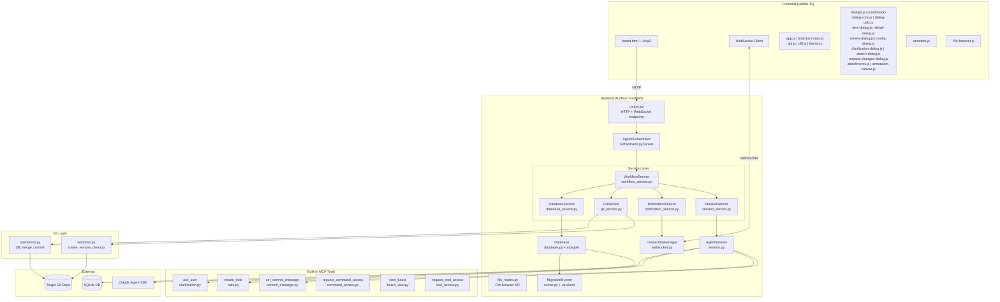
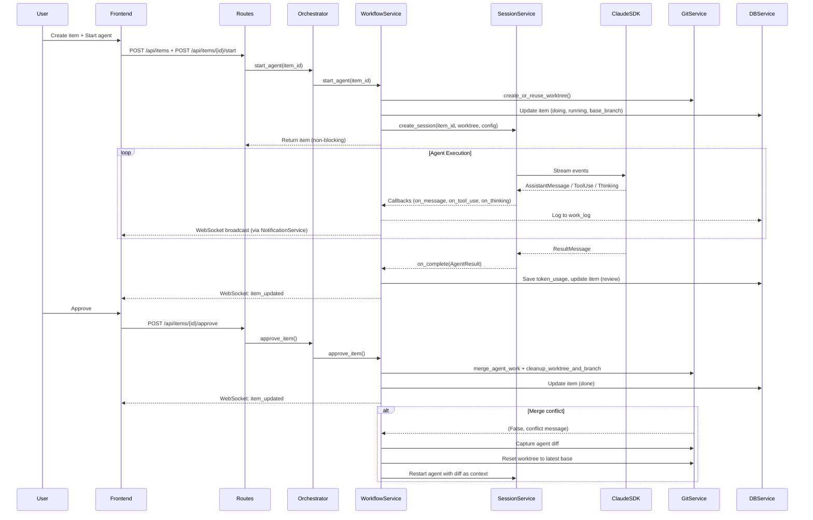
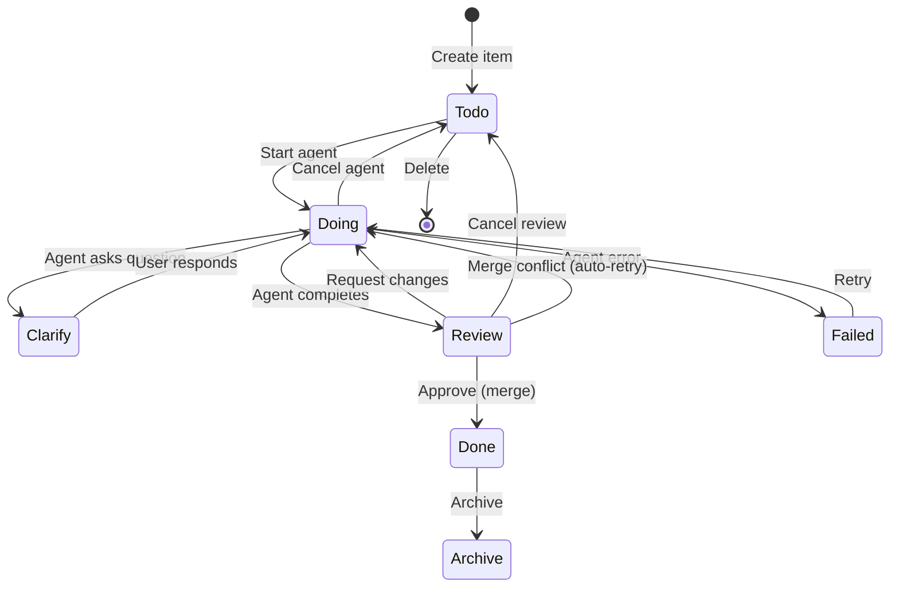
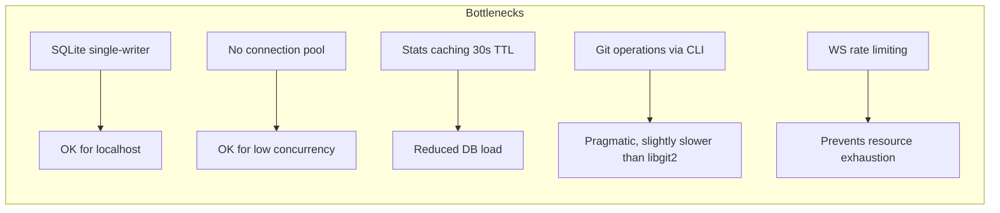

# Code Assessment: Agents Dashboard

**Date**: 2026-04-04
**Scope**: Full source code review of all Python backend, JavaScript frontend, and infrastructure files.
**Revision**: 20 — Maintenance reassessment with updated line counts. Added migration 012 (auto_start). Updated workflow_service.py (979 lines), database_service.py (482 lines), notification_service.py (114 lines), git_service.py (105 lines), item-dialog.js (491 lines), review-dialog.js (1,013 lines), style.css (1,476 lines), theme.css (101 lines). Updated totals: Python ~6,022 lines, JS ~6,350 lines, CSS ~3,111 lines. Database has 12 migrations. Test suite remains 165 tests.

---

## Executive Summary

Agents Dashboard is a well-architected, production-quality AI agent orchestration platform. The architecture follows clean separation of concerns with 5 focused service classes on the backend and 12 specialized dialog modules on the frontend. Since the previous assessment, **annotation summary** (migration 009), **epic grouping** (migration 010 — epics table, epic_id on items, CRUD routes, progress panel, board filtering, Todo grouping, card badges, agent MCP integration), **annotation prompt formatting**, **item dependencies** (migration 011 — join table for tracking dependencies between items), and **auto-start pipelines** (migration 012 — items auto-start agents when dependencies resolve) have been added. The test suite includes **165 automated tests** across smoke, unit, and integration tiers plus **E2E tests** via `run-e2e-tests.sh`, with coverage for diff isolation, command filtering, file browser routes, mini-MCP server protocol, epics, annotation summary/prompt, and orchestrator lifecycle.

**Overall Rating**: **A** (Strong — clean architecture, well-decomposed services, robust security posture)

---

## Architecture Assessment

### Strengths

1. **Clean service layer architecture**: Orchestrator is now a thin facade delegating to 5 focused services
2. **Single-responsibility modules**: Each service has a clear, bounded responsibility (DB, git, notifications, sessions, workflows)
3. **Modular frontend**: Dialog functionality split into 12 specialized modules with a coordinator pattern
4. **Async-first design**: Proper use of `asyncio` throughout — non-blocking agent starts, event-based clarification flow
5. **Real-time streaming**: WebSocket broadcasting with reconnection keeps the UI responsive
6. **Isolation via worktrees**: Each agent gets its own git worktree — safe parallel execution
7. **Defense in depth**: Rate limiting, path traversal protection, configurable timeouts, input validation
8. **Template decomposition**: Base template extracted, card partial for reuse

### Concerns

1. **No dependency injection**: Components are wired via `app.state` — works for a single-server app but limits testability
2. **Legacy compatibility layer**: Orchestrator retains `_update_item`, `_log`, `_format_tool_use`, `_get_agent_config` methods for backward compatibility — these could be removed once all callers use services directly

---

## Module-by-Module Assessment

### Backend Python — Service Layer (new)

| Module | Lines | Quality | Notes |
|--------|-------|---------|-------|
| `services/__init__.py` | — | A | Clean re-exports of all 5 services |
| `services/workflow_service.py` | 979 | A | Core workflow coordination with callback factory pattern, merge conflict auto-resolution, dirty repo overlap detection, and auto-start of dependent items |
| `services/database_service.py` | 482 | A | All DB operations extracted; parameterized queries throughout; item dependency management |
| `services/notification_service.py` | 114 | A | WebSocket broadcasting + tool formatting; clean separation |
| `services/git_service.py` | 105 | A | Git worktree and merge operations with proper error handling |
| `services/session_service.py` | 218 | A | Session lifecycle, commit messages, plugin parsing |

### Backend Python — Core

| Module | Lines | Quality | Notes |
|--------|-------|---------|-------|
| `main.py` | 107 | A | Clean entry point, proper git validation, port discovery |
| `config.py` | 110 | A | Well-organized constants; timeouts, WS rate limiting, defaults, and file browser configuration |
| `constants.py` | 32 | A | Centralized `AVAILABLE_MODELS` dict, `DEFAULT_MODEL`, `OPTIONAL_BUILTIN_TOOLS`, `EPIC_COLORS` |
| `models.py` | 116 | A | Clean Pydantic models, imports `DEFAULT_MODEL` from constants |
| `database.py` | 55 | A- | Clean async context manager; no connection pooling (acceptable for localhost) |
| `web/app.py` | 49 | A | Proper lifespan management, clean factory pattern |
| `web/routes.py` | 1,040 | A- | Comprehensive REST API; stats caching with TTL; search endpoint; delete delegates to orchestrator |
| `web/file_routes.py` | 199 | A | File browser endpoints with path validation, secret hiding, binary detection, language mapping, lazy tree scanning |
| `web/websocket.py` | 131 | A | Rate limiting by IP, connection attempt tracking, stats endpoint, dead-connection cleanup |
| `agent/orchestrator.py` | 122 | A | Clean facade pattern — delegates all operations to services; backward compatibility preserved |
| `agent/session.py` | 538 | A- | Clean SDK wrapper; good token extraction with fallbacks |
| `agent/clarification.py` | 51 | A | Clean MCP tool definition |
| `agent/todo.py` | 147 | A | Clean MCP tool definition with epic and dependency support |
| `agent/commit_message.py` | 50 | A | Clean MCP tool definition |
| `agent/command_access.py` | 42 | A | Clean MCP tool for runtime command approval |
| `agent/command_filter.py` | 42 | A | PreToolUse hook for bash command filtering |
| `agent/board_view.py` | 42 | A | Board introspection MCP tool |
| `agent/tool_access.py` | 42 | A | Runtime tool access request MCP tool |
| `agent/tool_filter.py` | 38 | A | PreToolUse hook for optional built-in tool filtering |
| `git/operations.py` | 339 | A- | Correct logic; async file reads; `validate_file_path()` prevents path traversal; configurable timeouts |
| `git/worktree.py` | 73 | A | Simple and correct; returns base branch for tracking |
| `migrations/runner.py` | 198 | A- | Solid migration system; class discovery uses string comparison (justified) |
| `migrations/migration.py` | 28 | A | Clean base class |
| `migrations/versions/001_initial_schema.py` | 158 | A | Complete initial schema with all 8 tables |
| `migrations/versions/002_add_base_branch.py` | 32 | A | Adds `base_branch` column to items table |
| `migrations/versions/003_add_allowed_commands.py` | 35 | A | Adds `allowed_commands` to agent_config |
| `migrations/versions/004_add_bash_yolo.py` | 26 | A | Adds `bash_yolo` flag to agent_config |
| `migrations/versions/005_add_base_commit.py` | 31 | A | Adds `base_commit` SHA to items table |
| `migrations/versions/006_add_allowed_builtin_tools.py` | 30 | A | Adds `allowed_builtin_tools` JSON array to agent_config |
| `migrations/versions/007_add_done_at.py` | 34 | A | Adds `done_at` timestamp to items, backfills existing done items |
| `migrations/versions/008_add_merge_commit.py` | 32 | A | Adds `merge_commit` SHA to items table |
| `migrations/versions/009_add_annotation_summary.py` | 32 | A | Adds `annotation_summary` to attachments table |
| `migrations/versions/010_add_epics.py` | 39 | A | Creates `epics` table and adds `epic_id` FK to items |
| `migrations/versions/011_add_item_dependencies.py` | 32 | A | Creates `item_dependencies` join table for dependency tracking |
| `migrations/versions/012_add_auto_start.py` | 38 | A | Adds `auto_start` column to items for automatic agent start on dependency resolution |

### Frontend JavaScript

| Module | Lines | Quality | Notes |
|--------|---------|---------|-------|
| `app.js` | 471 | A- | Full WebSocket reconnection with exponential backoff, visibility-aware, manual reconnect |
| `board.js` | 948 | A- | Drag-drop, card rendering, Done column day grouping with collapsible sections and bulk archive |
| `dialogs.js` | 86 | A | Clean coordinator pattern — delegates to 11 specialized modules |
| `dialog-core.js` | 82 | A | Core dialog open/close/confirm utilities |
| `dialog-utils.js` | 27 | A | Shared utilities (markdown rendering, model display names) |
| `item-dialog.js` | 491 | A- | New/edit item forms with attachment handling, epic assignment, dependency selection, auto-start toggle |
| `detail-dialog.js` | 241 | A- | Item detail view with tabbed interface |
| `review-dialog.js` | 1013 | A | Review dialog with diff viewer, work log, and tabbed interface |
| `config-dialog.js` | 189 | A | Agent configuration (system prompt, MCP, plugins) |
| `clarification-dialog.js` | 208 | A | Clean clarification prompt/response UI |
| `notification-dialog.js` | 103 | A | System notification display, bell icon, badge counter |
| `search-dialog.js` | 246 | A | Spotlight-style search across items and work logs |
| `request-changes-dialog.js` | 24 | A | Focused request-changes form |
| `attachments.js` | 43 | A | Attachment viewing and deletion |
| `annotation-canvas.js` | 97 | A | Canvas annotation integration bridge |
| `annotate.js` | 1003 | A- | Self-contained canvas component |
| `file-browser.js` | 630 | A | Full-featured file browser with tree view, tabbed viewer, lazy loading, keyboard navigation, filter, breadcrumbs, markdown/mermaid rendering |
| `api.js` | 102 | A | Clean HTTP helpers |
| `diff.js` | 62 | A- | Functional diff viewer |
| `theme.js` | 24 | A | Simple, correct theme toggle |
| `stats.js` | 184 | A- | Good auto-refresh and WebSocket update pattern |
| `sound.js` | 76 | A | Notification sound effects for agent events |

### Frontend CSS

| Module | Lines | Quality | Notes |
|--------|-------|---------|-------|
| `style.css` | 1,476 | A- | Main styles with CSS variables |
| `board.css` | 526 | A | Board layout, card styles, Done day grouping with collapsible sections |
| `dialog.css` | 451 | A | Dialog component styles |
| `file-browser.css` | 557 | A | File browser layout, tree, tabs, viewer, code/markdown/image styles, Prism.js light theme overrides, responsive |
| `theme.css` | 101 | A | Light/dark theme definitions |

**Note**: CSS total is ~3,111 lines across 5 modules (526+451+557+1476+101).

---

## Data Flow Analysis

---

## Item Lifecycle State Machine

---

## Security Assessment

| Area | Status | Details |
|------|--------|---------|
| Network binding | **Good** | Localhost only (127.0.0.1) |
| Authentication | **None** | No auth — acceptable for localhost dev tool |
| SQL injection | **Good** | Parameterized queries throughout (now centralized in DatabaseService) |
| Path traversal | **Good** | `validate_file_path()` blocks `..`, absolute paths, null bytes, and control characters; `serve_asset` checks `is_relative_to`; `validate_file_browser_path()` adds symlink-escape detection |
| Input validation | **Good** | Pydantic models validate API inputs |
| Secret handling | **Good** | API key from env var, never logged; file browser hides `.env`, `*.key`, `*.pem`, credentials, and SSH keys |
| Agent permissions | **Good** | `acceptEdits` mode, not `bypassPermissions` |
| WebSocket rate limiting | **Good** | Per-IP connection limits (5 concurrent, 10 per 60s window), connection attempt tracking |
| Git timeouts | **Good** | Configurable timeouts: operations (5min), merge (10min), HTTP requests (11min) |

### Recommendations

1. **Sanitize work log content** before rendering in frontend (markdown injection risk)

---

## Code Quality Findings

### Issues Resolved Since Last Assessment

| # | Issue | Resolution |
|---|-------|------------|
| 1 | Duplicate session creation logic | ✅ Extracted to `SessionService.create_session()` |
| 2 | Synchronous file read in async context | ✅ Uses `asyncio.to_thread()` |
| 3 | Unused `resume_id` variable | ✅ Passed to `start_session_task()` as `resume_session_id` |
| 4 | Double `_update_item` on merge conflict | ✅ Reduced to single call |
| 5 | No WebSocket reconnection in frontend | ✅ Full implementation with exponential backoff, visibility awareness, manual reconnect |
| 6 | `delete_item` cleanup inline in routes | ✅ Moved to `WorkflowService.delete_item()` |
| 7 | Hardcoded model strings | ✅ Centralized in `constants.py` |
| 8 | Path traversal via `git show` | ✅ `validate_file_path()` added |
| 9 | Stats endpoint multiple sequential queries | ✅ Stats caching with 30s TTL, invalidated on mutations |
| 10 | No WebSocket rate limiting | ✅ Per-IP rate limiting with concurrent connection limits and windowed attempt tracking |
| 11 | No request timeout for blocking operations | ✅ `asyncio.wait_for()` with `HTTP_REQUEST_TIMEOUT` on approve route |
| 12 | Migration class discovery uses string comparison | ✅ Justified — `issubclass` fails with dynamic module loading |
| 13 | Orchestrator too large (667 lines) | ✅ Decomposed into 5 services: WorkflowService (890), DatabaseService (468), NotificationService (107), GitService (94), SessionService (218). Orchestrator now 122-line facade |
| 14 | `dialogs.js` too large (801 lines) | ✅ Split into 12 specialized modules with coordinator pattern. Largest module is `search-dialog.js` at 246 lines |

### Remaining Issues

#### Medium Priority

3. **~10 minute delay between agent's last message and SDK completion callback**: Observed a consistent ~10 minute gap between the agent finishing its work (setting commit message, sending final text) and the `claude-agent-sdk` reporting the session as complete. The agent is idle during this time but the item stays in "Doing" instead of moving to "Review". This appears to be SDK/API-side overhead (possibly extended thinking finalization or session teardown). Consider detecting "agent is done talking" heuristically (e.g., after `set_commit_message` + no tool use for N seconds) to move items to Review earlier, before the SDK formally completes.

#### Low Priority

1. **No connection pooling**: Each DB operation opens/closes a connection via `aiosqlite.connect()`
   - Acceptable for localhost use but would bottleneck under load

2. **Legacy compatibility methods in orchestrator**: `_update_item`, `_log`, `_format_tool_use`, `_get_agent_config` remain as pass-throughs
   - **Recommendation**: Remove once all callers migrate to using services directly

---

## Test Coverage

**Current state**: 165 automated tests across 14 test files (including conftest.py) via `./run-tests.sh`, plus E2E tests via `./run-e2e-tests.sh`. Database has 12 migrations.

| Test File | Type | Tests | Focus |
|-----------|------|-------|-------|
| `tests/smoke/test_basic_functionality.py` | Smoke | 12 | Imports, DB basics, config |
| `tests/unit/test_path_validation.py` | Unit | 14 | Path traversal prevention |
| `tests/unit/test_git_timeout.py` | Unit | 5 | Git operation timeout behavior |
| `tests/unit/test_file_routes.py` | Unit | 35 | File browser path validation, secret detection, language mapping, directory scanning, file content reading |
| `tests/unit/test_allowed_commands.py` | Unit | 14 | Command filter hook, command access MCP tool, permission persistence, YOLO mode |
| `tests/unit/test_diff_mixing.py` | Unit | 6 | Diff isolation between items, concurrent diffs, base commit pinning |
| `tests/unit/test_mini_mcp.py` | Unit | 11 | Mini-MCP server stdio protocol, JSON-RPC messages, tool invocation |
| `tests/unit/migrations/test_migration_runner.py` | Unit | 14 | Migration engine |
| `tests/unit/migrations/test_migration_edge_cases.py` | Unit | 14 | Migration edge cases |
| `tests/unit/test_epics.py` | Unit | 19 | Epic CRUD, progress stats, item assignment, filtering, dependencies |
| `tests/unit/test_annotation_summary.py` | Unit | 2 | Annotation summary generation |
| `tests/unit/test_annotation_prompt.py` | Unit | 5 | Annotation prompt formatting for agents |
| `tests/integration/test_orchestrator_lifecycle.py` | Integration | 14 | Orchestrator lifecycle |
| `tests/conftest.py` | Fixtures | — | Shared test fixtures |

### Recommended Additional Tests

| Priority | Area | Type | Effort |
|----------|------|------|--------|
| **P1** | Service layer unit tests (WorkflowService, DatabaseService) | Unit | Medium |
| **P1** | WebSocket rate limiting | Unit | Low |
| **P1** | API routes (CRUD, agent actions) | Integration | Medium |
| **P2** | Token usage extraction | Unit | Low |
| **P2** | Stats caching and invalidation | Unit | Low |
| **P3** | Frontend dialog modules | E2E (Playwright) | High |

---

## Performance Considerations

- **SQLite**: Single-writer limitation is fine for localhost, but concurrent agents writing logs could contend
- **Stats caching**: 30s TTL with active invalidation on mutations — good balance of freshness and performance
- **Git operations**: Shell-out to `git` CLI is pragmatic but slower than libgit2 bindings
- **Git timeouts**: Configurable per operation type prevents hung processes

---

## Positive Patterns Worth Preserving

1. **Service layer decomposition**: 5 focused services with clear responsibilities replace monolithic orchestrator
2. **Facade pattern**: `AgentOrchestrator` provides a stable API while delegating to services
3. **Callback factory pattern**: `WorkflowService._create_on_*_callback()` methods keep callback creation centralized and consistent
4. **`_log_and_notify` helper**: Centralizes DB logging + WebSocket broadcast — prevents missed notifications
5. **Dialog coordinator pattern**: `dialogs.js` delegates to 12 specialized modules while preserving backward compatibility
6. **Commit message via MCP tool**: Agents produce meaningful commit messages rather than generic ones
7. **Worktree reuse on retry**: Preserves agent's previous work when retrying
8. **Dead WebSocket cleanup**: Broadcast loop silently removes failed connections
9. **Lifespan-managed shutdown**: Graceful agent cancellation on server stop via `SessionService.cleanup_all_sessions()`
10. **`validate_file_path()`**: Thorough path traversal prevention with multiple layers of checks
11. **Stats caching with invalidation**: Reduces DB pressure while keeping data fresh
12. **WebSocket reconnection**: Exponential backoff, visibility-aware, manual override — robust implementation
13. **Centralized constants**: `AVAILABLE_MODELS` and `DEFAULT_MODEL` in `constants.py` prevent string duplication
14. **WebSocket rate limiting**: Per-IP connection limits with configurable windows prevent resource exhaustion
15. **Base branch tracking**: Worktree creation returns and stores the base branch for reliable merge targeting
16. **Configurable git timeouts**: Separate timeouts for operations (5min) and merges (10min) prevent hung processes
17. **Template decomposition**: Base template extracted with card partial for consistent rendering
18. **Merge conflict auto-resolution**: On conflict, captures agent's diff, resets worktree to latest base, and restarts agent with previous diff as context — fully automated recovery
19. **File browser with defense in depth**: Path validation (null bytes, control chars, traversal, symlink escape), secret file hiding via configurable patterns, binary detection, configurable size limits, excluded dirs/files — all constants centralized in `config.py`
20. **Lazy tree loading**: File browser loads directory children on-demand with configurable depth limit, reducing initial payload for large projects
21. **Done column day grouping**: Completed items organized by date with collapsible sections, compact title lists, and per-day bulk archive — keeps the Done column manageable
22. **Done timestamp tracking**: `done_at` column with migration backfill ensures accurate completion tracking without relying on `updated_at` which changes on any modification
23. **Start Copy**: Creates a duplicate item and starts an agent on the copy, preserving the original Todo item for reuse — useful for iterative task refinement
24. **Merge commit tracking**: `merge_commit` column stores the SHA of the merge commit on approval, enabling traceability from board items to git history
25. **Dirty repo overlap detection**: Before merge, checks if the base repo has uncommitted changes overlapping with agent's files — blocks merge and moves to "questions" column with guidance, preventing silent data loss
26. **Archive cleanup**: Archiving items automatically cleans up worktree and session resources, preventing orphaned state
27. **Search dialog**: Spotlight-style search (Cmd/Ctrl+K) across items and work logs with keyboard navigation — fast item discovery in large boards
28. **Epic grouping**: Separate entity model (not items), collapsible progress panel, Todo column grouping, card badges, board filtering, inline creation, and agent MCP integration — clean implementation reusing existing patterns (day grouping for collapsible sections)
29. **Annotation summary**: Text description of annotation shapes stored in DB and included in agent prompts — gives agents context about visual annotations without needing to parse images
30. **Item dependencies**: Join table (`item_dependencies`) with cascading deletes tracks which items require other items — agents can declare dependencies via `create_todo` MCP tool's `requires` parameter, and `view_board` includes dependency info for coordination
31. **Auto-start pipelines**: Items with `auto_start` enabled (migration 012) automatically start an agent when all dependency items are resolved — `WorkflowService._notify_and_auto_start_dependents()` checks after each item completion/archive, enabling pipeline-style workflows without manual intervention

---

## Codebase Statistics

| Category | Files | Lines |
|----------|-------|-------|
| Python backend (src/) | 47 | ~6,022 |
| JavaScript frontend | 22 | ~6,350 |
| CSS styles | 5 | ~3,111 |
| HTML templates | 3 | ~635 |
| Tests | 14 | ~3,326 |
| **Grand total** | **91** | **~19,444** |

---

## Summary of Recommendations

| Priority | Recommendation | Effort |
|----------|---------------|--------|
| **Low** | Remove legacy compatibility methods from orchestrator | Low |
| **Low** | Sanitize work log markdown rendering | Low |
| **Low** | Add service layer unit tests | Medium |
| **Low** | Add WebSocket rate limiting unit tests | Low |
