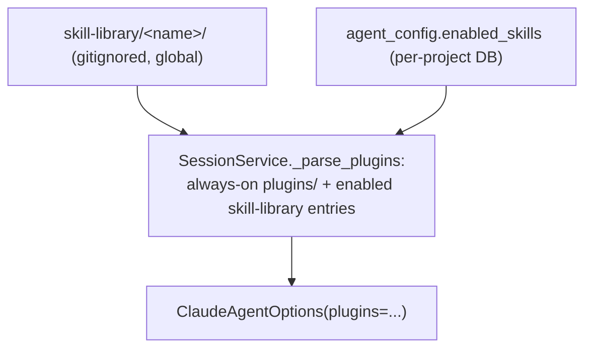

# PLAN: Skills library — install & per-project enable

Status: **implemented (Phases 1–2 complete; 1099 unit tests passing).** A Settings ▸ Skills tab that installs Agent Skills from public sources into a dashboard-managed library and lets each project enable a subset for its agents. Live-verified against `anthropics/skills` (browse 17 skills, install `algorithmic-art` → wrapped plugin).

## Motivation

Agents run with `setting_sources=["project"]` (`src/agent/session.py:551`), so **user `~/.claude/skills/` are NOT ingested** — only the target project's skills and skills delivered via the explicit `plugins=` option. We use the `plugins=` route (loads regardless of git/worktrees/`setting_sources`, never touches the target repo) to give agents a curated, per-project skill set.

## Research findings (2026-06-06)

| Source | Structure | Programmatic install? |
|---|---|---|
| **`anthropics/skills`** (GitHub) | `skills/<name>/SKILL.md` (YAML frontmatter `name`+`description`); repo is itself a `.claude-plugin` | ✅ GitHub Git-Trees API + raw fetch, no auth (60 req/hr unauth) |
| **`skills.pub`** | 1700+ skills, web catalog | ⚠️ **no API / no JSON index** — web link-out only |
| **Manual add** | paste a GitHub folder URL / `owner/repo[/path][@ref]` | ✅ same Trees+raw mirror; also covers skills.pub finds (mostly GitHub-hosted) |

## Locked decisions

1. **Delivery = dashboard-managed plugins** (not `<target>/.claude/skills`). Each installed skill is wrapped as a **one-skill plugin** so it can be toggled individually (the SDK `plugins=` option is all-or-nothing per plugin).
2. **Library location = `<dashboard>/skill-library/<name>/`, gitignored** in the dashboard repo. Global to the dashboard install (install once, use across projects). Layout per skill:
   ```
   skill-library/<name>/
     .claude-plugin/plugin.json     # synthesized: {name, version, description}
     skills/<name>/SKILL.md         # the skill (+ any sibling files)
   ```
3. **Per-project enable via the DB.** `agent_config` lives in `<target>/agents-lab/dashboard.db`, so an `enabled_skills` list there is automatically per-project. Install is global; **the enabled set is what differs per project.**
4. **Confirm before install** — a third-party skill injects instructions into agents; show `name`/`description` and require explicit confirm (YOLO/semantic-build pattern).
5. **`skills.pub` = web link-out** in the UI (no API to integrate).

## Mechanism



---

## Phase 1 — SkillsService + library + endpoints (backend) — COMPLETE

- [x] `src/services/skills_service.py`:
  - `library_dir` = `<repo_root>/skill-library`; `_ensure_gitignore()` adds `skill-library/` to the **dashboard** repo `.gitignore`.
  - `list_installed()` → scan `skill-library/*/`, parse each `skills/*/SKILL.md` frontmatter (`name`, `description`).
  - `browse(source="anthropic")` → GitHub Git-Trees API on `anthropics/skills` → skill folder names; descriptions fetched from each `SKILL.md` (cached). Network via `asyncio.to_thread(urllib)`.
  - `install(spec)` → resolve `owner/repo[/path][@ref]` or a GitHub folder URL; mirror the folder via Trees+raw into `skill-library/<name>/`, synthesize `.claude-plugin/plugin.json`. **Validate `<name>` is `[a-z0-9_-]+`** (no path traversal).
  - `remove(name)` → delete `skill-library/<name>/` (validated name).
  - `enabled(config)` / persistence handled at the route via `agent_config.enabled_skills`.
- [ ] **Migration 029**: `agent_config.enabled_skills TEXT DEFAULT '[]'`; `AgentConfig` model field; PUT `/api/config` (GET uses `SELECT *`).
- [ ] `SessionService._parse_plugins` — also append enabled skill-library plugin paths (resolve `config.get("enabled_skills")` against `skill-library/`). Built-in `plugins/` stay always-on.
- [ ] Endpoints in `routes.py`:
  - `GET  /api/skills` → `{installed:[{name,description,enabled}]}`
  - `GET  /api/skills/browse?source=anthropic` → available list (cached)
  - `POST /api/skills/install` `{spec}` → install + return installed entry
  - `POST /api/skills/{name}/enabled` `{enabled}` → update `enabled_skills`
  - `DELETE /api/skills/{name}` → remove from library + drop from `enabled_skills`
- [ ] Wire `SkillsService` into `AgentOrchestrator`.
- [ ] Tests: `test_skills_service.py` (mock GitHub fetch; list/install/remove/enable; name validation; `_parse_plugins` includes enabled), migration 029 test, route tests.

## Phase 2 — Settings ▸ Skills tab (frontend) — COMPLETE

- [x] `board.html` — `data-config-tab="skills"` pane: **Installed** (each with an enable toggle + remove), **Browse `anthropics/skills`** (list + Install), **Add by GitHub URL**, a `skills.pub` web link.
- [x] `config-dialog.js` — `refreshSkills()`, `browseSkills()`, `installSkill(spec)` (confirm), `toggleSkill(name, enabled)`, `removeSkill(name)`, with HTML-escaping. Live actions hitting `/api/skills/*` (not part of the config Save), mirroring the Ollama/Graphify tabs.
- [x] Tab button in the Settings tab row (after Graphify).
- [x] `enabled_skills` is **not** written by `PUT /api/config` — owned solely by `/api/skills/{name}/enabled` so saving Settings can't wipe a project's enabled set.
- [x] Tests: `test_skills_service.py` (incl. mocked install/browse + name-traversal guard), migration 029 test, `test_routes.py::TestSkills`. 1099 passing.

### Phase 2.1 — repo discovery + UI polish

- [x] **Repo discovery** — `SkillsService.discover(spec)` + `POST /api/skills/discover`: given a bare repo (`owner/repo` or URL) it scans the tree for **every** `SKILL.md` and returns one install candidate per skill (folder path = the SKILL.md's parent; install `spec` pinned to the resolved ref `@<sha/branch>`). "Add by URL" now scans first: 0 → message, 1 → install, >1 → a picker list. Exact skill paths still resolve to a single hit. Live-verified: `anthropics/skills` → 18 skills; exact path → 1.
- [x] **Row UI** — installed rows are now single-line `name … [×] [✓]` (name truncates with ellipsis, description on hover-title, enable checkbox right-aligned), replacing the broken wrapping/overlap layout. Browse + discovery results share one `_renderSkillChoices` renderer. 1103 passing.

## Risks

| Risk | Mitigation |
|---|---|
| Path traversal from remote skill name | validate `[a-z0-9_-]+`; never join raw remote paths |
| GitHub unauth rate limit (60/hr) | cache browse results; install is occasional; surface 403 cleanly |
| Third-party skill = instructions to agents | confirm-before-install showing name/description |
| Slow install (network) | run as background/awaited with a spinner; small folders |
| Library pollutes dashboard repo | `skill-library/` gitignored |

## Out of scope (later)

- `skills.pub` API integration (none exists).
- Versioning/auto-update of installed skills.
- Delivering skills via `<target>/.claude/skills` (we chose the plugin route).
