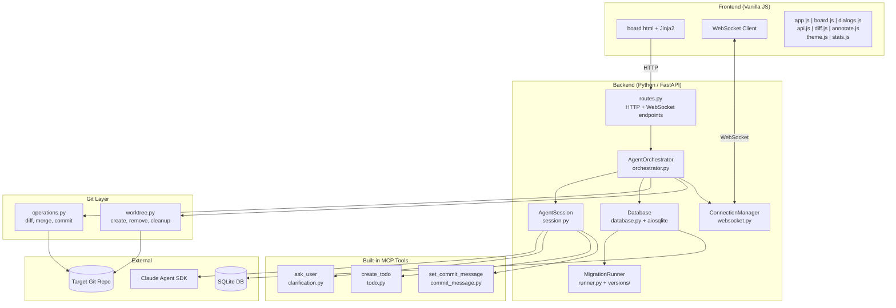
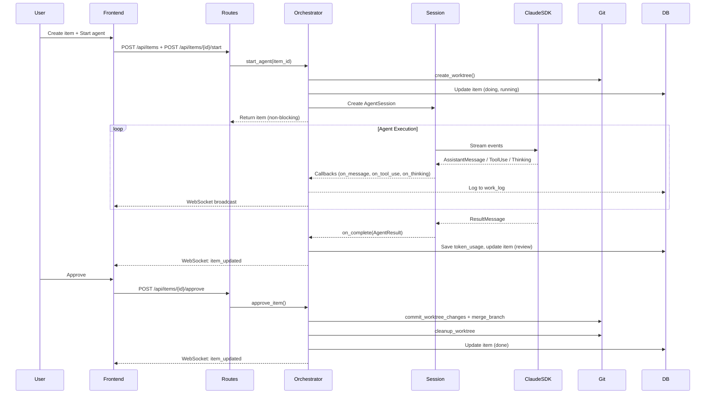
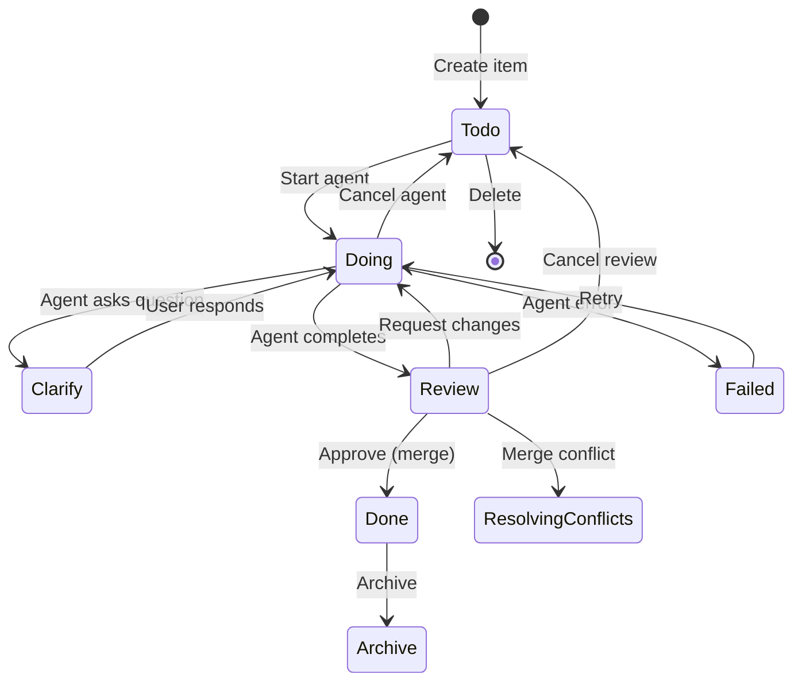
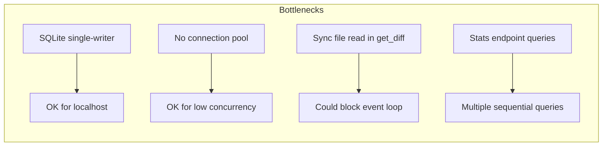

# Code Assessment: Agents Dashboard

**Date**: 2026-03-25
**Scope**: Full source code review of all Python backend, JavaScript frontend, and infrastructure files.

---

## Executive Summary

Agents Dashboard is a well-architected, production-quality AI agent orchestration platform. The codebase demonstrates clean separation of concerns, thoughtful async patterns, and a pragmatic approach to complexity. The code is readable, well-organized, and follows consistent conventions throughout. There are several areas for hardening and improvement, but no critical defects were found.

**Overall Rating**: **B+** (Strong — solid architecture, clean code, room for hardening)

---

## Architecture Assessment

### Strengths

1. **Clean layered architecture**: Web → Orchestrator → Session → SDK, with clear boundaries
2. **Single-responsibility modules**: Each file has a focused purpose (e.g., `worktree.py` only manages worktrees)
3. **Async-first design**: Proper use of `asyncio` throughout — non-blocking agent starts, event-based clarification flow
4. **Real-time streaming**: WebSocket broadcasting keeps the UI responsive without polling
5. **Isolation via worktrees**: Each agent gets its own git worktree — safe parallel execution

### Concerns

1. **No dependency injection**: Components are wired via `app.state` — works for a single-server app but limits testability
2. **Orchestrator is growing**: At ~600 lines, it handles agent lifecycle, DB writes, WebSocket broadcasts, and git coordination. Could benefit from extraction of a `WorkflowService`

---

## Module-by-Module Assessment

### Backend Python

| Module | Lines | Quality | Notes |
|--------|-------|---------|-------|
| `main.py` | 81 | A | Clean entry point, proper git validation, port discovery |
| `config.py` | 38 | A | Simple, well-organized constants |
| `models.py` | 97 | A | Clean Pydantic models, appropriate use of Optional |
| `database.py` | 55 | A- | Clean async context manager; duplicate `from pathlib import Path` in try/except |
| `web/app.py` | 46 | A | Proper lifespan management, clean factory pattern |
| `web/routes.py` | 515 | B+ | Comprehensive REST API; `delete_item` has inline cleanup logic that could be extracted |
| `web/websocket.py` | 26 | A | Simple, correct dead-connection cleanup |
| `agent/orchestrator.py` | 603 | B+ | Core logic is sound; growing large; duplicate session-creation code in `start_agent` and `request_changes` |
| `agent/session.py` | 265 | A- | Clean SDK wrapper; good token extraction with fallbacks |
| `agent/clarification.py` | 51 | A | Clean MCP tool definition |
| `agent/todo.py` | 57 | A | Clean MCP tool definition |
| `agent/commit_message.py` | 50 | A | Clean MCP tool definition |
| `git/operations.py` | 193 | B+ | Correct logic; `get_diff` reads file content synchronously in async context |
| `git/worktree.py` | 51 | A | Simple and correct |
| `migrations/runner.py` | 197 | A- | Solid migration system; class discovery uses string comparison instead of `issubclass` |
| `migrations/migration.py` | ~20 | A | Clean base class |

### Frontend JavaScript

| Module | Quality | Notes |
|--------|---------|-------|
| `app.js` | B+ | WebSocket reconnection would improve reliability |
| `board.js` | B+ | Drag-drop works well; card rendering could use templating |
| `dialogs.js` | B | Largest JS file; handles too many concerns (modals, config, plugins) |
| `api.js` | A | Clean HTTP helpers |
| `diff.js` | A- | Functional diff viewer |
| `annotate.js` | A- | Self-contained canvas component |
| `theme.js` | A | Simple, correct theme toggle |
| `stats.js` | A- | Good auto-refresh and WebSocket update pattern |

---

## Data Flow Analysis

---

## Item Lifecycle State Machine

---

## Security Assessment

| Area | Status | Details |
|------|--------|---------|
| Network binding | **Good** | Localhost only (127.0.0.1) |
| Authentication | **None** | No auth — acceptable for localhost dev tool |
| SQL injection | **Good** | Parameterized queries throughout |
| Path traversal | **Partial** | `serve_asset` checks `is_relative_to` but `get_file_content` passes user input to `git show` |
| Input validation | **Good** | Pydantic models validate API inputs |
| Secret handling | **Good** | API key from env var, never logged |
| Agent permissions | **Good** | `acceptEdits` mode, not `bypassPermissions` |

### Recommendations

1. **Validate `file_path` parameter** in `get_item_file` to prevent path traversal via `git show`
2. **Rate limit** WebSocket connections (currently unbounded)
3. **Sanitize work log content** before rendering in frontend (markdown injection risk)

---

## Code Quality Findings

### Issues Found

#### Medium Priority

1. **Duplicate session creation logic** (orchestrator.py:250-267 and 471-488)
   - `start_agent()` and `request_changes()` both construct `AgentSession` with identical callback wiring
   - **Recommendation**: Extract `_create_session(item_id, worktree_path, config)` helper

2. **Synchronous file read in async context** (operations.py:68)
   - `(worktree_path / f).read_text()` blocks the event loop for untracked files in `get_diff()`
   - **Recommendation**: Use `asyncio.to_thread()` or `aiofiles`

3. **Unused `resume_id` variable** (orchestrator.py:392)
   - `retry_agent()` captures `resume_id = item.get("session_id")` but never uses it
   - **Recommendation**: Either implement session resumption on retry or remove the variable

4. **Double `_update_item` call** on merge conflict (orchestrator.py:428-430)
   - `approve_item()` calls `_update_item(status="resolving_conflicts")` twice
   - **Recommendation**: Remove the duplicate call

5. **Migration class discovery** uses string name comparison (runner.py:65)
   - `any(base.__name__ == 'Migration' for base in attr.__bases__)` won't match deeper inheritance
   - **Recommendation**: Use `issubclass(attr, Migration)` with proper import

#### Low Priority

6. **No connection pooling**: Each DB operation opens/closes a connection via `aiosqlite.connect()`
   - Acceptable for localhost use but would bottleneck under load

7. **No WebSocket reconnection** in frontend `app.js`
   - If the connection drops, UI stops updating until page refresh

8. **`delete_item` cleanup logic** in routes.py is procedural
   - Mixes DB cleanup, agent cancellation, and git cleanup inline
   - **Recommendation**: Move to `orchestrator.delete_item()` for consistency

9. **Hardcoded model strings** in config.py and models.py
   - Model identifiers appear as string literals in multiple places
   - **Recommendation**: Define `AVAILABLE_MODELS` constant

10. **No request timeout** for agent operations
    - `start_agent` HTTP endpoint returns immediately, but `approve_item` blocks on git merge
    - Long-running merges could time out the HTTP request

---

## Test Coverage

**Current state**: No automated tests exist.

### Recommended Test Plan

| Priority | Area | Type | Effort |
|----------|------|------|--------|
| **P0** | Orchestrator lifecycle (start → complete → merge) | Integration | Medium |
| **P0** | Database migrations (up/down) | Unit | Low |
| **P1** | Git operations (diff, merge, worktree) | Integration | Medium |
| **P1** | API routes (CRUD, agent actions) | Integration | Medium |
| **P1** | MCP tool callbacks (clarification flow) | Unit | Low |
| **P2** | WebSocket broadcasting | Integration | Medium |
| **P2** | Token usage extraction | Unit | Low |
| **P3** | Frontend drag-drop | E2E (Playwright) | High |

---

## Performance Considerations

- **SQLite**: Single-writer limitation is fine for localhost, but concurrent agents writing logs could contend
- **Stats aggregation**: 5 sequential queries in `get_stats()` — could combine into fewer queries or cache
- **Git operations**: Shell-out to `git` CLI is pragmatic but slower than libgit2 bindings

---

## Positive Patterns Worth Preserving

1. **`_update_item` helper**: Centralizes DB update + WebSocket broadcast — prevents missed notifications
2. **`_format_tool_use`**: Human-readable tool summaries in work log — excellent UX decision
3. **Commit message via MCP tool**: Agents produce meaningful commit messages rather than generic ones
4. **Worktree reuse on retry**: Preserves agent's previous work when retrying
5. **Dead WebSocket cleanup**: Broadcast loop silently removes failed connections
6. **Lifespan-managed shutdown**: Graceful agent cancellation on server stop

---

## Summary of Recommendations

| Priority | Recommendation | Effort |
|----------|---------------|--------|
| **High** | Extract duplicate session-creation logic | Low |
| **High** | Fix double `_update_item` in merge conflict path | Trivial |
| **High** | Remove unused `resume_id` in `retry_agent` | Trivial |
| **Medium** | Add automated test suite (start with orchestrator + migrations) | High |
| **Medium** | Fix sync file read in `get_diff()` | Low |
| **Medium** | Add WebSocket reconnection in frontend | Low |
| **Medium** | Validate file paths in `get_item_file` | Low |
| **Low** | Extract `delete_item` cleanup to orchestrator | Low |
| **Low** | Define model constants instead of string literals | Low |
| **Low** | Optimize stats endpoint queries | Low |
