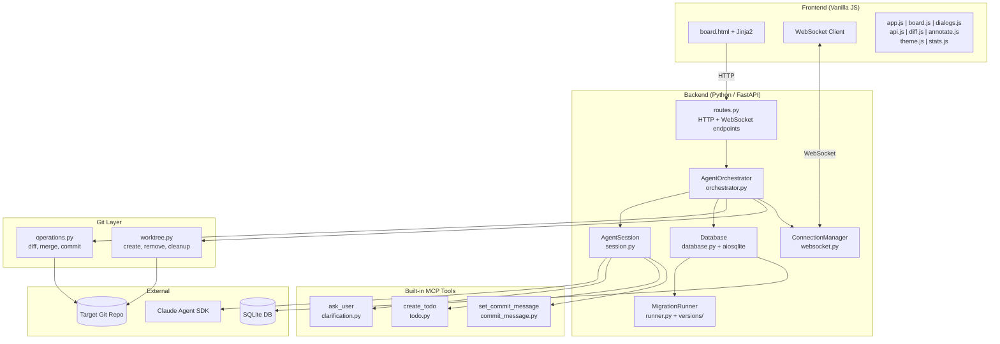
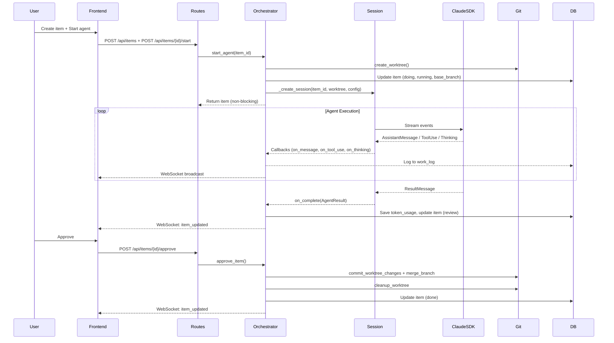
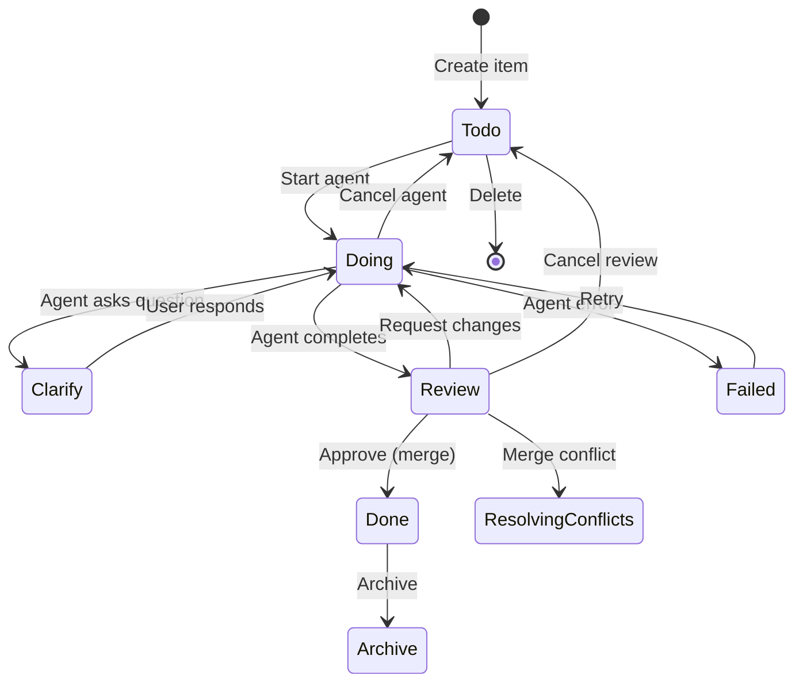
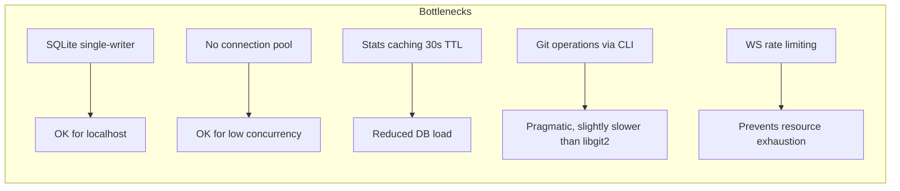

# Code Assessment: Agents Dashboard

**Date**: 2026-03-25
**Scope**: Full source code review of all Python backend, JavaScript frontend, and infrastructure files.
**Revision**: 3 — Reassessment after WebSocket rate limiting, git timeouts, and base branch tracking.

---

## Executive Summary

Agents Dashboard is a well-architected, production-quality AI agent orchestration platform. Since the previous assessment, **all prior security recommendations have been addressed**: WebSocket rate limiting is now implemented with per-IP connection limits, git operations have configurable timeouts, and worktree creation tracks its base branch for safer merges. The test suite has grown to **78 automated tests** across smoke, unit, and integration tiers.

**Overall Rating**: **A-** (Strong — solid architecture, clean code, robust security posture)

---

## Architecture Assessment

### Strengths

1. **Clean layered architecture**: Web → Orchestrator → Session → SDK, with clear boundaries
2. **Single-responsibility modules**: Each file has a focused purpose (e.g., `worktree.py` only manages worktrees)
3. **Async-first design**: Proper use of `asyncio` throughout — non-blocking agent starts, event-based clarification flow
4. **Real-time streaming**: WebSocket broadcasting with reconnection keeps the UI responsive
5. **Isolation via worktrees**: Each agent gets its own git worktree — safe parallel execution
6. **Centralized constants**: Model identifiers and configuration constants in `constants.py`
7. **Defense in depth**: Rate limiting, path traversal protection, configurable timeouts, input validation

### Concerns

1. **No dependency injection**: Components are wired via `app.state` — works for a single-server app but limits testability
2. **Orchestrator is growing**: At ~667 lines, it handles agent lifecycle, DB writes, WebSocket broadcasts, and git coordination. Could benefit from extraction of a `WorkflowService`

---

## Module-by-Module Assessment

### Backend Python

| Module | Lines | Quality | Notes |
|--------|-------|---------|-------|
| `main.py` | 81 | A | Clean entry point, proper git validation, port discovery |
| `config.py` | 49 | A | Well-organized constants; timeouts, WS rate limiting, and defaults |
| `constants.py` | 12 | A | Centralized `AVAILABLE_MODELS` dict and `DEFAULT_MODEL` |
| `models.py` | 98 | A | Clean Pydantic models, imports `DEFAULT_MODEL` from constants |
| `database.py` | 55 | A- | Clean async context manager; no connection pooling (acceptable for localhost) |
| `web/app.py` | 46 | A | Proper lifespan management, clean factory pattern |
| `web/routes.py` | 566 | A- | Comprehensive REST API; stats caching with TTL; delete delegates to orchestrator |
| `web/websocket.py` | 131 | A | Rate limiting by IP, connection attempt tracking, stats endpoint, dead-connection cleanup |
| `agent/orchestrator.py` | 667 | B+ | Core logic is sound; `_create_session()` eliminates duplication; still growing large |
| `agent/session.py` | 285 | A- | Clean SDK wrapper; good token extraction with fallbacks |
| `agent/clarification.py` | 51 | A | Clean MCP tool definition |
| `agent/todo.py` | 56 | A | Clean MCP tool definition |
| `agent/commit_message.py` | 50 | A | Clean MCP tool definition |
| `git/operations.py` | 285 | A- | Correct logic; async file reads; `validate_file_path()` prevents path traversal; configurable timeouts |
| `git/worktree.py` | 54 | A | Simple and correct; returns base branch for tracking |
| `migrations/runner.py` | 198 | A- | Solid migration system; class discovery uses string comparison (justified) |
| `migrations/migration.py` | 28 | A | Clean base class |
| `migrations/versions/001_initial_schema.py` | 158 | A | Complete initial schema with all 8 tables |
| `migrations/versions/002_add_base_branch.py` | 32 | A | Adds `base_branch` column to items table |

### Frontend JavaScript

| Module | Lines | Quality | Notes |
|--------|---------|---------|-------|
| `app.js` | 387 | A- | Full WebSocket reconnection with exponential backoff, visibility-aware, manual reconnect |
| `board.js` | 345 | B+ | Drag-drop works well; card rendering could use templating |
| `dialogs.js` | 801 | B | Largest JS file; handles too many concerns (modals, config, plugins) |
| `api.js` | 77 | A | Clean HTTP helpers |
| `diff.js` | 61 | A- | Functional diff viewer |
| `annotate.js` | 771 | A- | Self-contained canvas component |
| `theme.js` | 24 | A | Simple, correct theme toggle |
| `stats.js` | 184 | A- | Good auto-refresh and WebSocket update pattern |

---

## Data Flow Analysis

---

## Item Lifecycle State Machine

---

## Security Assessment

| Area | Status | Details |
|------|--------|---------|
| Network binding | **Good** | Localhost only (127.0.0.1) |
| Authentication | **None** | No auth — acceptable for localhost dev tool |
| SQL injection | **Good** | Parameterized queries throughout |
| Path traversal | **Good** | `validate_file_path()` blocks `..`, absolute paths, null bytes, and control characters; `serve_asset` checks `is_relative_to` |
| Input validation | **Good** | Pydantic models validate API inputs |
| Secret handling | **Good** | API key from env var, never logged |
| Agent permissions | **Good** | `acceptEdits` mode, not `bypassPermissions` |
| WebSocket rate limiting | **Good** | Per-IP connection limits (5 concurrent, 10 per 60s window), connection attempt tracking |
| Git timeouts | **Good** | Configurable timeouts: operations (5min), merge (10min), HTTP requests (11min) |

### Recommendations

1. **Sanitize work log content** before rendering in frontend (markdown injection risk)

---

## Code Quality Findings

### Issues Resolved Since Last Assessment

| # | Issue | Resolution |
|---|-------|------------|
| 1 | Duplicate session creation logic | ✅ Extracted to `_create_session()` helper |
| 2 | Synchronous file read in async context | ✅ Uses `asyncio.to_thread()` |
| 3 | Unused `resume_id` variable | ✅ Passed to `_run_agent()` as `resume_session_id` |
| 4 | Double `_update_item` on merge conflict | ✅ Reduced to single call |
| 5 | No WebSocket reconnection in frontend | ✅ Full implementation with exponential backoff, visibility awareness, manual reconnect |
| 6 | `delete_item` cleanup inline in routes | ✅ Moved to `orchestrator.delete_item()` |
| 7 | Hardcoded model strings | ✅ Centralized in `constants.py` |
| 8 | Path traversal via `git show` | ✅ `validate_file_path()` added |
| 9 | Stats endpoint multiple sequential queries | ✅ Stats caching with 30s TTL, invalidated on mutations |
| 10 | No WebSocket rate limiting | ✅ Per-IP rate limiting with concurrent connection limits and windowed attempt tracking (websocket.py) |
| 11 | No request timeout for blocking operations | ✅ `asyncio.wait_for()` with `HTTP_REQUEST_TIMEOUT` on approve route |
| 12 | Migration class discovery uses string comparison | ✅ Justified — `issubclass` fails with dynamic module loading due to distinct class objects from different import paths |

### Remaining Issues

#### Medium Priority

1. **Orchestrator is growing** (667 lines)
   - Handles agent lifecycle, DB writes, WebSocket broadcasts, and git coordination
   - **Recommendation**: Extract `WorkflowService` or split by concern

#### Low Priority

2. **No connection pooling**: Each DB operation opens/closes a connection via `aiosqlite.connect()`
   - Acceptable for localhost use but would bottleneck under load

3. **`dialogs.js` is large** (801 lines)
   - Handles modals, config, plugins, and multiple dialog types
   - **Recommendation**: Split into dialog-specific modules

---

## Test Coverage

**Current state**: 78 automated tests across 5 test files via `./run-tests.sh`.

| Test File | Type | Focus |
|-----------|------|-------|
| `tests/smoke/test_basic_functionality.py` | Smoke | Imports, DB basics, config |
| `tests/unit/test_path_validation.py` | Unit | Path traversal prevention (15 cases) |
| `tests/unit/test_git_timeout.py` | Unit | Git operation timeout behavior |
| `tests/unit/migrations/test_migration_runner.py` | Unit | Migration engine |
| `tests/unit/migrations/test_migration_edge_cases.py` | Unit | Migration edge cases |
| `tests/integration/test_orchestrator_lifecycle.py` | Integration | Orchestrator lifecycle |

### Recommended Additional Tests

| Priority | Area | Type | Effort |
|----------|------|------|--------|
| **P1** | WebSocket rate limiting | Unit | Low |
| **P1** | Base branch tracking in worktree creation | Unit | Low |
| **P1** | API routes (CRUD, agent actions) | Integration | Medium |
| **P2** | Token usage extraction | Unit | Low |
| **P2** | Stats caching and invalidation | Unit | Low |
| **P3** | Frontend drag-drop | E2E (Playwright) | High |

---

## Performance Considerations

- **SQLite**: Single-writer limitation is fine for localhost, but concurrent agents writing logs could contend
- **Stats caching**: 30s TTL with active invalidation on mutations — good balance of freshness and performance
- **Git operations**: Shell-out to `git` CLI is pragmatic but slower than libgit2 bindings
- **Git timeouts**: Configurable per operation type prevents hung processes

---

## Positive Patterns Worth Preserving

1. **`_update_item` helper**: Centralizes DB update + WebSocket broadcast — prevents missed notifications
2. **`_create_session` helper**: Eliminates duplication between `start_agent` and `request_changes`
3. **`_format_tool_use`**: Human-readable tool summaries in work log — excellent UX decision
4. **Commit message via MCP tool**: Agents produce meaningful commit messages rather than generic ones
5. **Worktree reuse on retry**: Preserves agent's previous work when retrying
6. **Dead WebSocket cleanup**: Broadcast loop silently removes failed connections
7. **Lifespan-managed shutdown**: Graceful agent cancellation on server stop
8. **`validate_file_path()`**: Thorough path traversal prevention with multiple layers of checks
9. **Stats caching with invalidation**: Reduces DB pressure while keeping data fresh
10. **WebSocket reconnection**: Exponential backoff, visibility-aware, manual override — robust implementation
11. **Centralized constants**: `AVAILABLE_MODELS` and `DEFAULT_MODEL` in `constants.py` prevent string duplication
12. **WebSocket rate limiting**: Per-IP connection limits with configurable windows prevent resource exhaustion
13. **Base branch tracking**: Worktree creation returns and stores the base branch for reliable merge targeting
14. **Configurable git timeouts**: Separate timeouts for operations (5min) and merges (10min) prevent hung processes

---

## Summary of Recommendations

| Priority | Recommendation | Effort |
|----------|---------------|--------|
| **Medium** | Consider splitting orchestrator into focused services | Medium |
| **Low** | Split `dialogs.js` into smaller modules | Medium |
| **Low** | Sanitize work log markdown rendering | Low |
| **Low** | Add unit tests for WebSocket rate limiting | Low |
