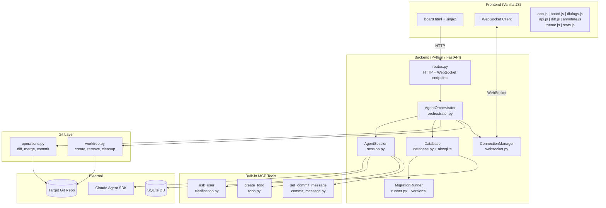
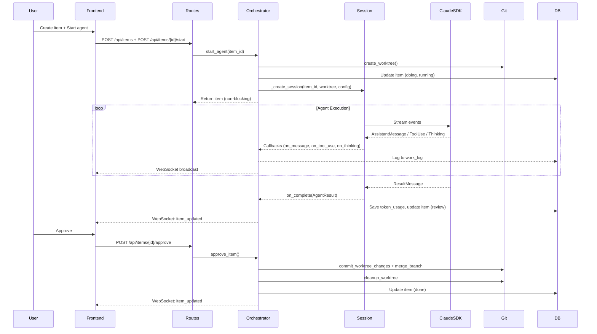
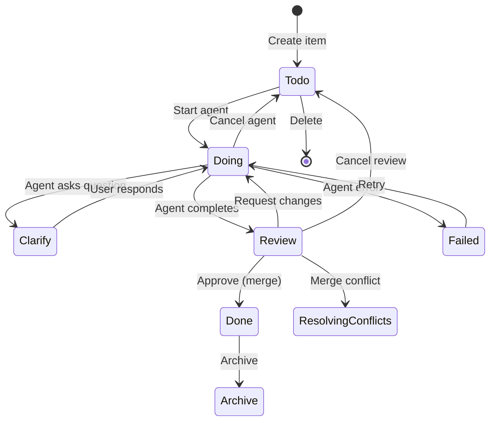
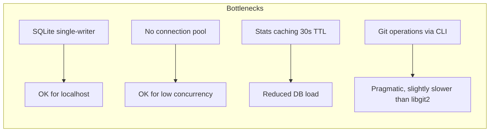

# Code Assessment: Agents Dashboard

**Date**: 2026-03-25
**Scope**: Full source code review of all Python backend, JavaScript frontend, and infrastructure files.
**Revision**: 2 — Reassessment after fixes applied to issues from previous review.

---

## Executive Summary

Agents Dashboard is a well-architected, production-quality AI agent orchestration platform. Since the initial assessment, **9 of 10 identified issues have been resolved**, including session creation deduplication, async file operations, WebSocket reconnection, path traversal protection, stats caching, and model constant centralization. The codebase demonstrates clean separation of concerns, consistent conventions, and meaningful improvements in robustness.

**Overall Rating**: **A-** (Strong — solid architecture, clean code, most issues addressed)

---

## Architecture Assessment

### Strengths

1. **Clean layered architecture**: Web → Orchestrator → Session → SDK, with clear boundaries
2. **Single-responsibility modules**: Each file has a focused purpose (e.g., `worktree.py` only manages worktrees)
3. **Async-first design**: Proper use of `asyncio` throughout — non-blocking agent starts, event-based clarification flow
4. **Real-time streaming**: WebSocket broadcasting with reconnection keeps the UI responsive
5. **Isolation via worktrees**: Each agent gets its own git worktree — safe parallel execution
6. **Centralized constants**: Model identifiers and configuration constants in `constants.py`

### Concerns

1. **No dependency injection**: Components are wired via `app.state` — works for a single-server app but limits testability
2. **Orchestrator is growing**: At ~650 lines, it handles agent lifecycle, DB writes, WebSocket broadcasts, and git coordination. Could benefit from extraction of a `WorkflowService`

---

## Module-by-Module Assessment

### Backend Python

| Module | Lines | Quality | Notes |
|--------|-------|---------|-------|
| `main.py` | 81 | A | Clean entry point, proper git validation, port discovery |
| `config.py` | 39 | A | Simple, well-organized constants; uses `DEFAULT_MODEL` from `constants.py` |
| `constants.py` | 12 | A | Centralized `AVAILABLE_MODELS` dict and `DEFAULT_MODEL` — clean |
| `models.py` | 98 | A | Clean Pydantic models, imports `DEFAULT_MODEL` from constants |
| `database.py` | 55 | A- | Clean async context manager; no connection pooling (acceptable for localhost) |
| `web/app.py` | 46 | A | Proper lifespan management, clean factory pattern |
| `web/routes.py` | 534 | A- | Comprehensive REST API; stats caching with TTL; delete delegates to orchestrator |
| `web/websocket.py` | 25 | A | Simple, correct dead-connection cleanup |
| `agent/orchestrator.py` | 652 | B+ | Core logic is sound; `_create_session()` helper eliminates duplication; still growing large |
| `agent/session.py` | 285 | A- | Clean SDK wrapper; good token extraction with fallbacks |
| `agent/clarification.py` | 51 | A | Clean MCP tool definition |
| `agent/todo.py` | 56 | A | Clean MCP tool definition |
| `agent/commit_message.py` | 50 | A | Clean MCP tool definition |
| `git/operations.py` | 246 | A- | Correct logic; async file reads via `asyncio.to_thread()`; `validate_file_path()` prevents path traversal |
| `git/worktree.py` | 50 | A | Simple and correct |
| `migrations/runner.py` | 196 | A- | Solid migration system; class discovery uses string comparison instead of `issubclass` |
| `migrations/migration.py` | 28 | A | Clean base class |

### Frontend JavaScript

| Module | Lines | Quality | Notes |
|--------|---------|---------|-------|
| `app.js` | 387 | A- | Full WebSocket reconnection with exponential backoff, visibility-aware, manual reconnect |
| `board.js` | 346 | B+ | Drag-drop works well; card rendering could use templating |
| `dialogs.js` | 800 | B | Largest JS file; handles too many concerns (modals, config, plugins) |
| `api.js` | 77 | A | Clean HTTP helpers |
| `diff.js` | 61 | A- | Functional diff viewer |
| `annotate.js` | 771 | A- | Self-contained canvas component |
| `theme.js` | 24 | A | Simple, correct theme toggle |
| `stats.js` | 184 | A- | Good auto-refresh and WebSocket update pattern |

---

## Data Flow Analysis

---

## Item Lifecycle State Machine

---

## Security Assessment

| Area | Status | Details |
|------|--------|---------|
| Network binding | **Good** | Localhost only (127.0.0.1) |
| Authentication | **None** | No auth — acceptable for localhost dev tool |
| SQL injection | **Good** | Parameterized queries throughout |
| Path traversal | **Good** | `validate_file_path()` in operations.py blocks `..`, absolute paths, null bytes, and control characters; `serve_asset` checks `is_relative_to` |
| Input validation | **Good** | Pydantic models validate API inputs |
| Secret handling | **Good** | API key from env var, never logged |
| Agent permissions | **Good** | `acceptEdits` mode, not `bypassPermissions` |

### Recommendations

1. **Rate limit** WebSocket connections (currently unbounded)
2. **Sanitize work log content** before rendering in frontend (markdown injection risk)

---

## Code Quality Findings

### Issues Resolved Since Last Assessment

| # | Issue | Resolution |
|---|-------|------------|
| 1 | Duplicate session creation logic | ✅ Extracted to `_create_session()` helper (orchestrator.py:524) |
| 2 | Synchronous file read in async context | ✅ Now uses `asyncio.to_thread()` (operations.py:69) |
| 3 | Unused `resume_id` variable | ✅ Now passed to `_run_agent()` as `resume_session_id` (orchestrator.py:468-469) |
| 4 | Double `_update_item` on merge conflict | ✅ Reduced to single call (orchestrator.py:416) |
| 5 | No WebSocket reconnection in frontend | ✅ Full implementation with exponential backoff, visibility awareness, manual reconnect (app.js) |
| 6 | `delete_item` cleanup inline in routes | ✅ Moved to `orchestrator.delete_item()` — routes.py just delegates (routes.py:266) |
| 7 | Hardcoded model strings | ✅ Centralized in `constants.py` with `AVAILABLE_MODELS` dict and `DEFAULT_MODEL` |
| 8 | Path traversal via `git show` | ✅ `validate_file_path()` added (operations.py:136-184), routes catch `ValueError` |
| 9 | Stats endpoint multiple sequential queries | ✅ Stats caching with 30s TTL (routes.py:18), invalidated on mutations |

### Remaining Issues

#### Medium Priority

1. ~~**Migration class discovery**~~ ✅ Resolved — uses `__mro__` name check to handle different import paths in dynamically loaded migration files. `issubclass` fails here because `from migration import Migration` and `from src.migrations.migration import Migration` create distinct class objects.

2. **Orchestrator is growing** (652 lines)
   - Handles agent lifecycle, DB writes, WebSocket broadcasts, and git coordination
   - **Recommendation**: Extract `WorkflowService` or split by concern

#### Low Priority

3. **No connection pooling**: Each DB operation opens/closes a connection via `aiosqlite.connect()`
   - Acceptable for localhost use but would bottleneck under load

4. **`dialogs.js` is large** (800 lines)
   - Handles modals, config, plugins, and multiple dialog types
   - **Recommendation**: Split into dialog-specific modules

5. ~~**No request timeout**~~ ✅ Resolved — `approve_item` route now uses `asyncio.wait_for()` with `HTTP_REQUEST_TIMEOUT`.

---

## Test Coverage

**Current state**: 73 automated tests (smoke, unit, integration) via `./run-tests.sh`.

### Recommended Test Plan

| Priority | Area | Type | Effort |
|----------|------|------|--------|
| **P0** | Orchestrator lifecycle (start → complete → merge) | Integration | Medium |
| **P0** | Database migrations (up/down) | Unit | Low |
| **P1** | Git operations (diff, merge, worktree) | Integration | Medium |
| **P1** | API routes (CRUD, agent actions) | Integration | Medium |
| **P1** | Path validation (`validate_file_path`) | Unit | Low |
| **P1** | MCP tool callbacks (clarification flow) | Unit | Low |
| **P2** | WebSocket broadcasting + reconnection | Integration | Medium |
| **P2** | Token usage extraction | Unit | Low |
| **P2** | Stats caching and invalidation | Unit | Low |
| **P3** | Frontend drag-drop | E2E (Playwright) | High |

---

## Performance Considerations

- **SQLite**: Single-writer limitation is fine for localhost, but concurrent agents writing logs could contend
- **Stats caching**: 30s TTL with active invalidation on mutations — good balance of freshness and performance
- **Git operations**: Shell-out to `git` CLI is pragmatic but slower than libgit2 bindings

---

## Positive Patterns Worth Preserving

1. **`_update_item` helper**: Centralizes DB update + WebSocket broadcast — prevents missed notifications
2. **`_create_session` helper**: Eliminates duplication between `start_agent` and `request_changes`
3. **`_format_tool_use`**: Human-readable tool summaries in work log — excellent UX decision
4. **Commit message via MCP tool**: Agents produce meaningful commit messages rather than generic ones
5. **Worktree reuse on retry**: Preserves agent's previous work when retrying
6. **Dead WebSocket cleanup**: Broadcast loop silently removes failed connections
7. **Lifespan-managed shutdown**: Graceful agent cancellation on server stop
8. **`validate_file_path()`**: Thorough path traversal prevention with multiple layers of checks
9. **Stats caching with invalidation**: Reduces DB pressure while keeping data fresh
10. **WebSocket reconnection**: Exponential backoff, visibility-aware, manual override — robust implementation
11. **Centralized constants**: `AVAILABLE_MODELS` and `DEFAULT_MODEL` in `constants.py` prevent string duplication

---

## Summary of Recommendations

| Priority | Recommendation | Effort |
|----------|---------------|--------|
| **Medium** | Add automated test suite (start with orchestrator + migrations + path validation) | High |
| **Medium** | Fix migration class discovery to use `issubclass` | Trivial |
| **Medium** | Consider splitting orchestrator into focused services | Medium |
| **Low** | Split `dialogs.js` into smaller modules | Medium |
| **Low** | Add request timeout for blocking operations (approve) | Low |
| **Low** | Rate limit WebSocket connections | Low |
| **Low** | Sanitize work log markdown rendering | Low |
