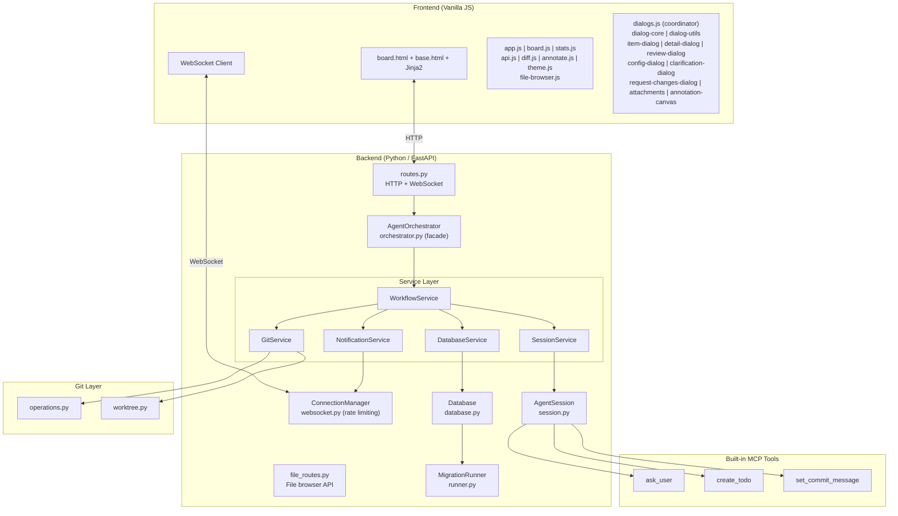
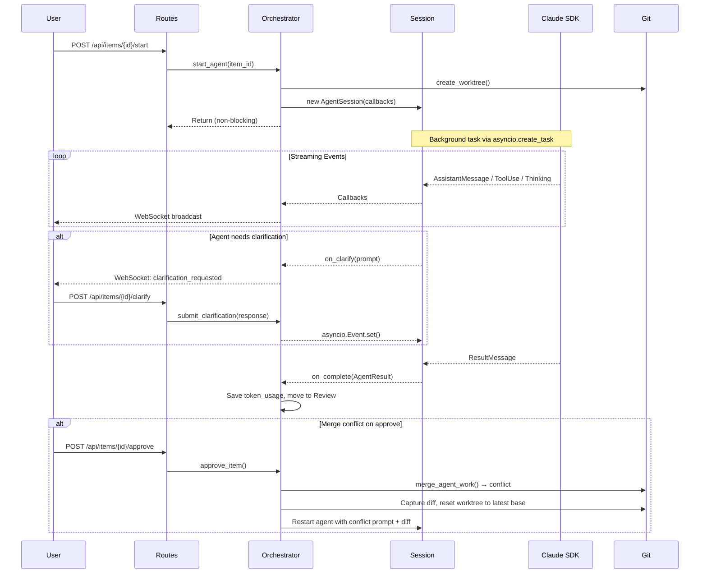
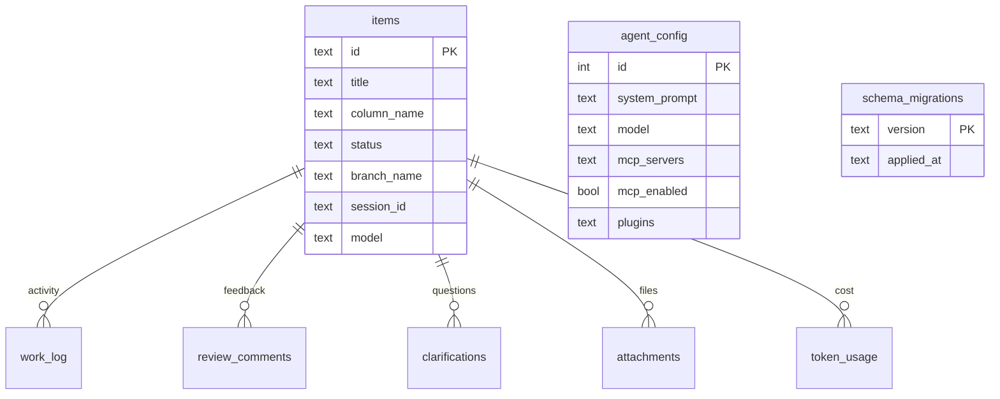

# CLAUDE.md

This file provides guidance to Claude Code (claude.ai/code) when working with code in this repository.

## Running the project

```bash
# From a target git repo (the project agents will work on):
path/to/claude-agents-dashboard/run.sh

# Or with explicit path:
./run.sh /path/to/target-project
```

`run.sh` creates the venv if needed, installs deps from `requirements.txt`, and launches `python -m src.main <target>`. Server binds to 127.0.0.1:8000 (auto-increments if busy). Requires Python 3.12+.

## Running tests

```bash
./run-tests.sh              # Run all 108 tests
./run-tests.sh tests/smoke/ # Smoke tests only
./run-tests.sh -k "test_cancel" # Filter by name
```

Tests use `pytest` with `pytest-asyncio` (auto mode). Three tiers: smoke (imports, DB basics), unit (path validation, git timeouts, migration runner, migration edge cases, file browser routes), integration (orchestrator lifecycle). See `tests/README.md` for details.

## Architecture

This is a standalone scrum board tool that orchestrates Claude agents working on a **separate target project**. The server code lives here; the data directory (`agents-lab/`) is created in the target project.

### System overview



### Request flow

```
Browser <-WebSocket-> ConnectionManager (websocket.py)
Browser <-HTTP-> FastAPI routes (routes.py) + file_routes.py
                |
         AgentOrchestrator (facade, orchestrator.py)
                |
         WorkflowService (workflow_service.py)
           |         |         |           |
    SessionService  GitService  DBService  NotificationService
         |              |          |            |
    AgentSession    Git ops    SQLite DB    WebSocket broadcast
    (session.py)    (git/)     (database.py)
         |
    ClaudeSDKClient (claude-agent-sdk)
```

### Agent lifecycle



### Key design decisions

- **Service layer architecture**: The orchestrator is a thin facade (111 lines) that delegates to 5 focused services:
  - `WorkflowService` (405 lines): Coordinates agent workflows, state transitions, callback creation, and merge conflict auto-resolution
  - `DatabaseService` (182 lines): All database operations (items, logs, config, attachments, token usage)
  - `NotificationService` (96 lines): WebSocket broadcasting and tool use formatting
  - `GitService` (94 lines): Worktree management, merge operations, and cleanup
  - `SessionService` (153 lines): Agent session lifecycle, commit messages, plugin parsing

- **Agent start is non-blocking**: `WorkflowService.start_agent()` creates a session via `SessionService.create_session()` and launches it via `SessionService.start_session_task()` which uses `asyncio.create_task()` so the HTTP response returns immediately. The agent streams progress via WebSocket.

- **One worktree per item**: Each agent task gets a git worktree (`agents-lab/worktrees/agent-{item_id}`) branched off the current branch. `GitService.create_or_reuse_worktree()` returns a `(worktree_path, branch_name, base_branch)` tuple, and the base branch is stored in the item's `base_branch` column (added in migration 002) for reliable merge targeting. This allows multiple agents to run simultaneously without conflicts.

- **Clarification uses asyncio.Event**: When an agent calls the `ask_user` MCP tool, the `WorkflowService._create_on_clarify_callback()` moves the item to "Clarify", broadcasts to the frontend, and `await`s an `asyncio.Event`. The HTTP endpoint `submit_clarification` sets the event, unblocking the agent.

- **Todo creation via MCP**: Agents can create new todo items via the `create_todo` MCP tool. This flows through `WorkflowService._create_on_create_todo_callback()`, creates items via `DatabaseService.create_todo_item()` with proper positioning, and broadcasts real-time updates via `NotificationService`.

- **Per-item model selection**: Items can have an individual `model` field. `WorkflowService.start_agent()` uses `item.get("model") or config.get("model")`, falling back to the global agent config default (`claude-sonnet-4-20250514`). Available models are centralized in `constants.py` as `AVAILABLE_MODELS`: Claude Sonnet 4 (`claude-sonnet-4-20250514`), Claude Opus 3 (`claude-3-opus-20240229`), and Claude Haiku 3 (`claude-3-haiku-20240307`).

- **Session creation**: `SessionService.create_session()` centralizes AgentSession construction with standard callbacks, system prompt building, and plugin parsing. Both `start_agent()` and `request_changes()` in WorkflowService use this to avoid duplication.

- **Session resumption**: `ResultMessage.session_id` is stored in the DB. When requesting changes, the agent resumes its previous session via `ClaudeAgentOptions(resume=session_id, continue_conversation=True)` so it retains full conversation context.

- **Token usage extraction**: `AgentResult` includes `input_tokens`, `output_tokens`, `total_tokens` alongside `cost_usd`. Token extraction in `session.py` handles SDK field name variants (`input_tokens` vs `input_token_count`) and calculates totals from components as a fallback.

- **Path traversal protection**: `validate_file_path()` in operations.py blocks absolute paths, `..` traversal, null bytes, control characters, and other dangerous patterns before passing paths to `git show`. Routes catch `ValueError` for 400 responses.

- **Diff includes uncommitted changes**: `get_diff()` and `get_changed_files()` accept a `worktree_path` parameter. When provided, they combine committed branch diff + uncommitted changes + untracked files, since agents don't always commit their work. Untracked file reads use `asyncio.to_thread()` to avoid blocking the event loop.

- **Merge commits worktree first**: `merge_branch()` calls `commit_worktree_changes()` before merging, handling agents that leave uncommitted work. Uses agent-provided commit messages when available (via `set_commit_message` MCP tool).

- **Merge conflict auto-resolution**: If a merge conflict occurs, `GitService.merge_agent_work()` returns `(False, message)`. `WorkflowService.approve_item()` then captures the agent's diff, resets the worktree to the latest base branch (`git fetch origin base && git reset --hard base`), and restarts the agent with a conflict prompt containing the previous diff. The agent reapplies its changes to the updated codebase. Falls back to `conflict` status if the diff cannot be captured.

- **Cost & token tracking**: Agent completion logs USD cost and token usage (input/output/total) via `AgentResult`. Token data is persisted to the `token_usage` table by `DatabaseService.save_token_usage()`. Completion formatting uses `NotificationService.format_completion_log()`.

- **Stats dashboard**: The `/api/stats` endpoint aggregates token usage, cost, message counts, tool calls, item status distribution, and recent activity. Server-side stats caching with 30s TTL (`_stats_cache` in routes.py) reduces DB load, with cache invalidation on mutations (create, delete, move, start, approve). The frontend `StatsManager` (in `stats.js`) renders a stats bar in the header, auto-refreshes every 10 seconds, and updates on WebSocket events (item_created, item_updated, item_moved, agent_log) with debouncing. Stats bar is hidden on small screens (< 768px).

- **Retry reuses worktree**: `WorkflowService.retry_agent()` cleans up any existing session via `SessionService`, reuses the existing worktree via `GitService.create_or_reuse_worktree()` if present, and starts a fresh agent run. It does not resume the previous session.

- **Cancel review**: `WorkflowService.cancel_review()` discards review changes by cleaning up the worktree and branch via `GitService`, then moves the item back to "Todo" status with cleared git metadata. Route: `POST /api/items/{item_id}/cancel-review`.

- **Delete cleans up everything**: `WorkflowService.delete_item()` stops any running agent via `SessionService`, deletes DB records via `DatabaseService.delete_item_and_related()` (cascades to `work_log`, `review_comments`, `clarifications`, `attachments`), removes the git worktree and branch via `GitService`, and cleans up attachment files from disk.

- **WebSocket rate limiting**: `ConnectionManager` in `websocket.py` enforces per-IP connection limits (`WEBSOCKET_MAX_CONNECTIONS_PER_IP = 5` concurrent, `WEBSOCKET_MAX_CONNECTIONS_PER_WINDOW = 10` attempts per 60s window). Tracks connections by IP with `connections_by_ip` dict and `connection_attempts` deque. Rate-limited clients receive code 4008 close. `get_connection_stats()` provides monitoring data. Config constants are in `config.py`.

- **Git operation timeouts**: All git operations use configurable timeouts from `config.py`: `GIT_OPERATION_TIMEOUT` (300s / 5min) for most operations, `GIT_MERGE_TIMEOUT` (600s / 10min) for merges, and `HTTP_REQUEST_TIMEOUT` (660s / 11min) for HTTP endpoints wrapping git operations. Prevents hung processes.

- **External MCP tool allowance**: External MCP servers loaded from `mcp-config.json` get wildcard tool permissions (`mcp__{server_name}__*`). Built-in servers (`clarification`, `todo`, `commit_message`) get explicit individual tool permissions instead.

- **Plugin support**: Agents can load local Claude Code plugins via directory paths. Plugins are configured in the agent config UI (Plugins tab) and stored as a JSON array of paths in `agent_config.plugins`. The orchestrator's `_parse_plugins()` normalizes entries into `{"type": "local", "path": "..."}` dicts passed to the SDK.

- **File browser**: `file_routes.py` provides `/api/files/tree` and `/api/files/content` endpoints for browsing the target project. Tree scanning uses `os.scandir` via `asyncio.to_thread()` with configurable depth limits (`FILE_BROWSER_TREE_DEPTH = 2`) for lazy loading. Path validation (`validate_file_browser_path()`) blocks absolute paths, `..` traversal, null bytes, control characters, and symlink escapes. Secret files (`.env`, `*.key`, `*.pem`, credentials, SSH keys) are hidden via `is_secret_file()` using configurable patterns. Binary detection falls back to `UnicodeDecodeError`. Images (PNG, JPG, GIF, SVG, WebP) are returned as base64 data URIs. Text files are truncated at 1MB. Language detection maps file extensions to Prism.js identifiers. All constants are centralized in `config.py`. The frontend `file-browser.js` provides a tabbed viewer with tree navigation, filter, keyboard navigation (arrow keys + Enter), breadcrumbs, markdown rendering with mermaid diagram support, and Prism.js syntax highlighting.

- **Save & Start**: The new item dialog has a "Save & Start" button that creates an item and immediately launches an agent in one action, skipping the manual start step.

- **Work log tool formatting**: `NotificationService.format_tool_use()` renders human-readable summaries for common tools (Write, Edit, Read, Bash, Glob, Grep, ask_user, create_todo, set_commit_message). Unknown tools show a truncated input summary.

- **Last agent message tracking**: `SessionService._last_agent_messages` dict tracks the latest text message per item for quick access without querying the work log.

- **Commit message storage**: `SessionService._commit_messages` dict stores commit messages set by agents via MCP tool. Retrieved via `get_commit_message()` and persisted to DB on agent completion by `WorkflowService._create_on_complete_callback()`.

### Frontend

Vanilla JS with no build step. Server-renders the initial board via Jinja2 (base template + board template + card partial); JavaScript handles all subsequent updates via WebSocket events and fetch API. `marked.js` (CDN) renders markdown in descriptions and work logs.

**Core modules**: `app.js` (WebSocket with auto-reconnection + exponential backoff + visibility awareness + init), `board.js` (drag-drop + card rendering), `api.js` (HTTP helpers), `diff.js` (diff viewer), `annotate.js` (annotation canvas), `theme.js` (light/dark mode toggle), `stats.js` (real-time stats bar with auto-refresh and WebSocket updates), `file-browser.js` (project file browser with tree, tabs, syntax highlighting, markdown/mermaid rendering).

**Dialog modules** (modular architecture): `dialogs.js` is a thin coordinator that delegates to 10 specialized modules:
- `dialog-core.js` — open/close/confirm utilities
- `dialog-utils.js` — markdown rendering, model display names
- `item-dialog.js` — new/edit item forms with attachments
- `detail-dialog.js` — item detail view with tabbed interface
- `review-dialog.js` — review dialog with diff viewer and work log
- `config-dialog.js` — agent configuration (system prompt, MCP, plugins)
- `clarification-dialog.js` — clarification prompt/response UI
- `request-changes-dialog.js` — request changes form
- `attachments.js` — attachment viewing and deletion
- `annotation-canvas.js` — canvas annotation integration bridge

**CSS modules**: `style.css` (main styles with CSS variables), `board.css` (board layout and cards), `dialog.css` (dialog components), `file-browser.css` (file browser layout, tree, tabs, viewer, Prism.js light theme overrides), `theme.css` (light/dark theme definitions).

### Database



SQLite via aiosqlite with a versioned migration system. Migration files are in `src/migrations/versions/` (currently 2 migrations: `001_initial_schema.py` creates the complete schema, `002_add_base_branch.py` adds base branch tracking to items). Tables: `items` (board cards + git metadata + model + commit_message + base_branch), `work_log` (agent activity stream with JSON metadata), `review_comments`, `clarifications`, `attachments` (annotated images), `agent_config` (single-row settings with MCP config + plugins), `token_usage` (per-session token consumption and cost), `schema_migrations` (migration tracking). Agents can create new todo items directly via MCP tools, automatically positioned in the todo column.

Note: Attachment deletion uses `/api/attachments/{attachment_id}` (not nested under items) since attachments have their own integer IDs.

#### Migration System

- **Migration runner**: `src/migrations/runner.py` manages applying/rolling back migrations
- **Migration files**: `src/migrations/versions/XXX_description.py` contain versioned schema changes (`001_initial_schema.py` for base schema, `002_add_base_branch.py` for base branch tracking)
- **Schema tracking**: `schema_migrations` table tracks which migrations have been applied
- **CLI management**: `python -m src.manage` for migration commands
- **Auto-migration**: Database automatically runs pending migrations on startup

## Important patterns

- All state changes broadcast via `NotificationService` methods (`broadcast_item_updated`, `broadcast_item_created`, etc.) for real-time UI updates.
- The `WorkflowService._log_and_notify()` helper centralizes DB logging + WebSocket broadcast in one call.
- `Starlette TemplateResponse` requires `request` as first kwarg: `TemplateResponse(request=request, name="...", context={...})`.
- Agent's `cwd` is set to the worktree path, and the system prompt explicitly tells the agent its working directory. `add_dirs` is also set to allow file operations there. Agent sessions use `permission_mode="acceptEdits"` for targeted autonomy (more restricted than `bypassPermissions`).
- Extended thinking is enabled (`thinking={"type": "enabled", "budget_tokens": 10000}`) for richer agent reasoning.
- Never use browser `confirm()` or `prompt()` in dialogs — they block and conflict with `<dialog>` modals. Use `Dialogs.confirm()` which returns a Promise.
- Tooltips use JS positioning (`position: fixed`, appended to the nearest open `<dialog>` or `document.body`) so they appear above modal dialogs. Use `data-tip` for plain text, `data-tip-html` for rich formatted tooltips.
- Avoid duplicate `from pathlib import Path` inside functions — it's imported at file top and local imports cause `UnboundLocalError`.
- Attachments are stored as PNG files in `agents-lab/assets/` and referenced in the `attachments` table. Cleaned up on item delete.
- The annotation canvas (`annotate.js`) is a self-contained component: `Annotate.init(canvasEl)` to start, `Annotate.toDataURL()` to export. Supports image drop, scale (wheel + corner handles), and annotation tools.
- Card action buttons use `event.stopPropagation()` on individual buttons, not on the wrapper div, to avoid click blind spots.
- MCP tool callbacks follow async patterns: clarification uses `asyncio.Event` in `WorkflowService` for user response, todo creation immediately returns success and broadcasts via `NotificationService`, commit message stores in-memory (`SessionService._commit_messages` dict) and persists to DB on agent completion.
- Agent-created items are indistinguishable from manually created ones in the database and UI — they follow the same lifecycle and support all features.
- The agent config dialog (`config-dialog.js`) has three tabs: General (system prompt, model, project context), MCP (server JSON config, enable/disable toggle), and Plugins (local plugin directory paths with add/remove UI).
- Port auto-discovery scans 8000-8019 (`MAX_PORT_TRIES = 20` in `config.py`).

## Project structure

```
src/
+-- main.py                           # Entry point, port discovery
+-- config.py                         # Column definitions, timeouts, rate limits, default config, file browser settings
+-- constants.py                      # AVAILABLE_MODELS, DEFAULT_MODEL
+-- models.py                         # Pydantic models
+-- database.py                       # DB connection + migration init
+-- manage.py                         # CLI for migrations
+-- web/
|   +-- app.py                       # FastAPI factory + lifespan
|   +-- routes.py                    # All HTTP/WS endpoints
|   +-- file_routes.py              # File browser API (tree + content)
|   +-- websocket.py                 # ConnectionManager + rate limiting
+-- agent/
|   +-- orchestrator.py              # Facade — delegates to services
|   +-- session.py                   # Claude SDK wrapper
|   +-- clarification.py             # ask_user MCP tool
|   +-- todo.py                      # create_todo MCP tool
|   +-- commit_message.py            # set_commit_message MCP tool
+-- services/
|   +-- __init__.py                  # Re-exports all services
|   +-- workflow_service.py          # Agent workflow coordination + state transitions
|   +-- database_service.py          # All database operations
|   +-- notification_service.py      # WebSocket broadcasting + tool formatting
|   +-- git_service.py              # Git worktree + merge operations
|   +-- session_service.py          # Agent session lifecycle + commit messages
+-- git/
|   +-- operations.py                # diff, merge, commit
|   +-- worktree.py                  # worktree CRUD
+-- migrations/
|   +-- migration.py                 # Base class
|   +-- runner.py                    # Migration engine
|   +-- versions/
|       +-- 001_initial_schema.py    # Complete schema (8 tables)
|       +-- 002_add_base_branch.py  # Base branch tracking
+-- static/
|   +-- js/
|   |   +-- app.js                   # WebSocket + init
|   |   +-- board.js                 # Drag-drop + card rendering
|   |   +-- dialogs.js               # Dialog coordinator
|   |   +-- dialog-core.js           # Open/close/confirm
|   |   +-- dialog-utils.js          # Shared utilities
|   |   +-- item-dialog.js           # New/edit item
|   |   +-- detail-dialog.js         # Item detail view
|   |   +-- review-dialog.js         # Review + diff
|   |   +-- config-dialog.js         # Agent config
|   |   +-- clarification-dialog.js  # Clarification UI
|   |   +-- request-changes-dialog.js # Request changes form
|   |   +-- attachments.js           # Attachment management
|   |   +-- annotation-canvas.js     # Canvas bridge
|   |   +-- annotate.js              # Canvas component
|   |   +-- file-browser.js         # Project file browser
|   |   +-- api.js                   # HTTP helpers
|   |   +-- diff.js                  # Diff viewer
|   |   +-- stats.js                 # Stats bar
|   |   +-- theme.js                 # Theme toggle
|   +-- css/
|       +-- style.css                # Main styles (CSS variables)
|       +-- board.css                # Board layout + cards
|       +-- dialog.css               # Dialog components
|       +-- file-browser.css        # File browser styles
|       +-- theme.css                # Light/dark themes
+-- templates/
    +-- base.html                    # Base template
    +-- board.html                   # Board template
    +-- partials/
        +-- card.html                # Card partial
```

## Development workflows

### Adding new features

1. **Backend changes**:
   - Update models in `models.py`
   - Create database migration in `src/migrations/versions/` for schema changes
   - Implement business logic in the appropriate service (`services/workflow_service.py` for workflows, `services/database_service.py` for DB operations, etc.)
   - Add HTTP endpoints in `routes.py`

2. **Database changes**:
   - Copy `src/migrations/versions/000_template.py.example` to `XXX_description.py`
   - Update version number sequentially (e.g., `003`, `004`, etc.)
   - Implement `up()` method for schema changes and `down()` method for rollback
   - Test migration with `python -m src.manage migrate` and rollback with `python -m src.manage rollback`

3. **Frontend changes**: Add HTML in templates, update the appropriate dialog module (or create a new one following the modular pattern), handle WebSocket events in `app.js`, broadcast state changes from `NotificationService`.

4. **Agent capabilities**: Extend the system prompt in `SessionService.create_session()`, add MCP tools via the agent config UI, configure plugins via the Plugins tab, or modify `ask_user` clarification flows or `create_todo` workflows in `WorkflowService`.

### Testing changes

Run the automated test suite (108 tests):
```bash
./run-tests.sh              # All tests
./run-tests.sh tests/smoke/ # Smoke tests only
./run-tests.sh -k "test_path" # Filter by name
```

For manual verification of UI and agent features:
- Starting the server against a test git repository
- Creating board items and testing the full agent workflow
- Testing edge cases: git conflicts, agent failures, clarification flows
- Testing agent MCP tools: clarification prompts, todo creation
- Checking WebSocket updates in browser dev tools for real-time features
- Verifying git worktree cleanup after item completion
- Testing todo creation: ensure agents can create items that appear properly positioned

### Debugging

**Agent issues**: Check the work log for detailed agent output. Enable more verbose logging by setting `thinking={"type": "enabled", "budget_tokens": 20000}` in agent options.

**WebSocket problems**: Open browser dev tools → Network tab → WS → check for connection errors. The server logs WebSocket events to console.

**Git worktree issues**: Check `agents-lab/worktrees/` for orphaned directories. Clean up manually if needed:
```bash
git worktree list
git worktree remove agents-lab/worktrees/agent-XXXXX
```

**Database problems**: The SQLite file is at `agents-lab/dashboard.db`. Use `sqlite3` CLI or DB Browser to inspect:
```bash
sqlite3 agents-lab/dashboard.db ".schema"
sqlite3 agents-lab/dashboard.db "SELECT * FROM items;"
```

**Migration issues**: Use the migration CLI to debug schema problems:
```bash
python -m src.manage status  # Check current state
python -m src.manage migrate  # Apply pending migrations
python -m src.manage rollback 001  # Rollback to version 001
```

**Performance**: The app is designed for localhost use. For large repositories, git operations may be slow. Consider shallow clones for worktrees if needed.

### Adding new MCP tools

1. Create the tool server following MCP spec
2. Update agent config via the UI to include your MCP server
3. Test via the agent clarification flow or direct tool use
4. Document new tools in the agent system prompt if they require specific usage patterns

### Built-in MCP tools

The system includes several built-in MCP tools for agents:

- **`ask_user`** (clarification): Allows agents to ask users questions and wait for responses. Moves items to "Clarify" column and resumes when answered.
- **`create_todo`** (todo creation): Enables agents to create new todo items with title and optional description. Items are automatically positioned in the todo column and broadcast to all connected clients.
- **`set_commit_message`** (commit message): Allows agents to set a custom commit message for their work. Stored in the database and used during merge instead of the generic "Agent work on agent/xxx" message.
