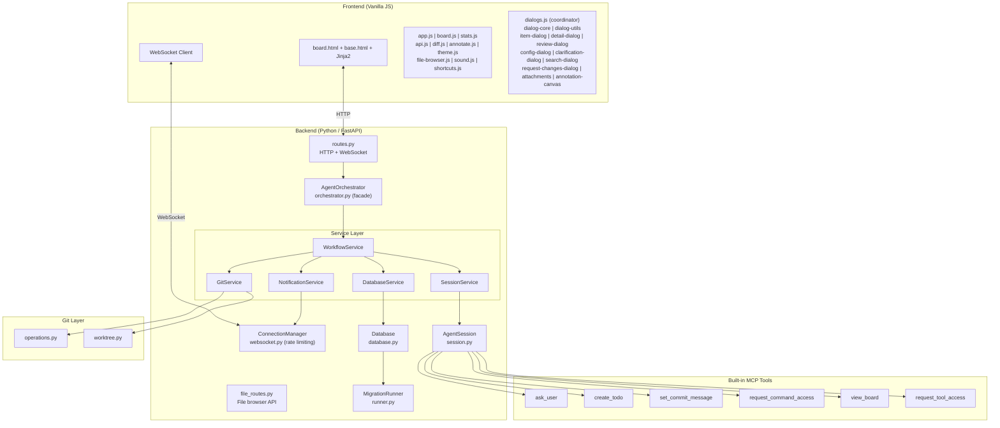
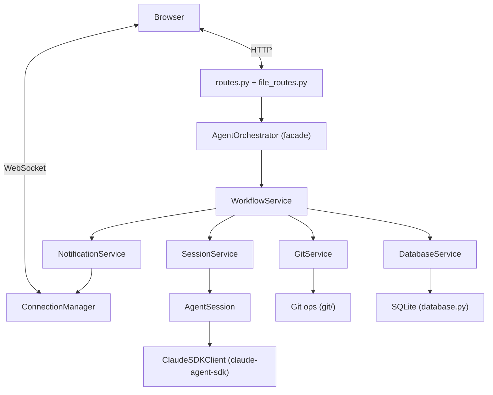
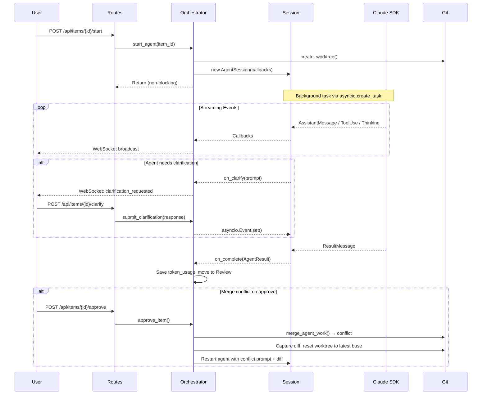
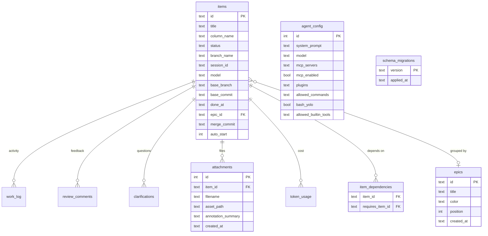

# CLAUDE.md

This file provides guidance to Claude Code (claude.ai/code) when working with code in this repository.

## Running the project

```bash
# From a target git repo (the project agents will work on):
path/to/claude-agents-dashboard/run.sh

# Or with explicit path:
./run.sh /path/to/target-project
```

`run.sh` creates the venv if needed, installs deps from `requirements.txt`, and launches `python -m src.main <target>`. Server binds to 127.0.0.1:8000 (auto-increments if busy). Requires Python 3.12+.

## Running tests

```bash
./run-tests.sh              # Run all 165 tests
./run-tests.sh tests/smoke/ # Smoke tests only
./run-tests.sh -k "test_cancel" # Filter by name
```

Tests use `pytest` with `pytest-asyncio` (auto mode). Three tiers: smoke (12 tests — imports, DB basics), unit (139 tests — path validation, git timeouts, migration runner, migration edge cases, file browser routes, allowed commands, diff mixing, mini-MCP server, epics, annotation summary, annotation prompt), integration (14 tests — orchestrator lifecycle). Database has 12 migrations. E2E tests run separately via `./run-e2e-tests.sh`. See `tests/README.md` for details.

## Architecture

This is a standalone scrum board tool that orchestrates Claude agents working on a **separate target project**. The server code lives here; the data directory (`agents-lab/`) is created in the target project.

### System overview



### Request flow



### Agent lifecycle



### Key design decisions

- **Service layer architecture**: The orchestrator is a thin facade (122 lines) that delegates to 5 focused services (total ~1,912 lines):
  - `WorkflowService` (979 lines): Coordinates agent workflows, state transitions, callback creation, merge conflict auto-resolution, dirty repo overlap detection, and auto-start of dependent items
  - `DatabaseService` (482 lines): All database operations (items, logs, config, attachments, token usage, item dependencies)
  - `NotificationService` (114 lines): WebSocket broadcasting and tool use formatting
  - `GitService` (105 lines): Worktree management, merge operations, and cleanup
  - `SessionService` (218 lines): Agent session lifecycle, commit messages, plugin parsing

- **Agent start is non-blocking**: `WorkflowService.start_agent()` creates a session via `SessionService.create_session()` and launches it via `SessionService.start_session_task()` which uses `asyncio.create_task()` so the HTTP response returns immediately. The agent streams progress via WebSocket.

- **One worktree per item**: Each agent task gets a git worktree (`agents-lab/worktrees/agent-{item_id}`) branched off the current branch. `GitService.create_or_reuse_worktree()` returns a `(worktree_path, branch_name, base_branch, base_commit)` tuple. The base branch is stored in the item's `base_branch` column (migration 002) for reliable merge targeting, and the base commit SHA is stored in `base_commit` (migration 005) for stable diff computation. This allows multiple agents to run simultaneously without conflicts.

- **Clarification uses asyncio.Event**: When an agent calls the `ask_user` MCP tool, the `WorkflowService._create_on_clarify_callback()` moves the item to "Clarify", broadcasts to the frontend, and `await`s an `asyncio.Event`. The HTTP endpoint `submit_clarification` sets the event, unblocking the agent.

- **Todo creation via MCP**: Agents can create new todo items via the `create_todo` MCP tool. This flows through `WorkflowService._create_on_create_todo_callback()`, creates items via `DatabaseService.create_todo_item()` with proper positioning, and broadcasts real-time updates via `NotificationService`. Supports an optional `requires` parameter (list of item IDs) to declare dependencies via `DatabaseService.set_item_dependencies()`, stored in the `item_dependencies` join table (migration 011). Items can also be created with `auto_start` enabled (migration 012) so they automatically start an agent when all dependencies are resolved.

- **Per-item model selection**: Items can have an individual `model` field. `WorkflowService.start_agent()` uses `item.get("model") or config.get("model")`, falling back to the global agent config default (`claude-sonnet-4-20250514`). Available models are centralized in `constants.py` as `AVAILABLE_MODELS`: Claude Sonnet 4 (`claude-sonnet-4-20250514`), Claude Opus 3 (`claude-3-opus-20240229`), and Claude Haiku 3 (`claude-3-haiku-20240307`).

- **Session creation**: `SessionService.create_session()` centralizes AgentSession construction with standard callbacks, system prompt building, and plugin parsing. Both `start_agent()` and `request_changes()` in WorkflowService use this to avoid duplication.

- **Session resumption**: `ResultMessage.session_id` is stored in the DB. When requesting changes, the agent resumes its previous session via `ClaudeAgentOptions(resume=session_id, continue_conversation=True)` so it retains full conversation context.

- **Token usage extraction**: `AgentResult` includes `input_tokens`, `output_tokens`, `total_tokens` alongside `cost_usd`. Token extraction in `session.py` handles SDK field name variants (`input_tokens` vs `input_token_count`) and calculates totals from components as a fallback.

- **Path traversal protection**: `validate_file_path()` in operations.py blocks absolute paths, `..` traversal, null bytes, control characters, and other dangerous patterns before passing paths to `git show`. Routes catch `ValueError` for 400 responses.

- **Diff includes uncommitted changes**: `get_diff()` and `get_changed_files()` accept a `worktree_path` parameter. When provided, they combine committed branch diff + uncommitted changes + untracked files, since agents don't always commit their work. Untracked file reads use `asyncio.to_thread()` to avoid blocking the event loop. When `base_commit` is provided, diffs use the pinned commit SHA instead of the branch name, ensuring stability even after other items are merged into the base branch.

- **Bash YOLO mode**: When `bash_yolo` is enabled in agent config (migration 004), agents run with `permission_mode="bypassPermissions"` instead of `acceptEdits`, granting unrestricted bash access. This skips the command filter hook entirely. Useful for trusted environments where command restrictions are unnecessary.

- **Configurable built-in tools**: Users can enable optional built-in Claude Code tools (e.g., WebSearch, WebFetch) via the "Tools" tab in Agent Configuration. Enabled tools are stored as a JSON array in `agent_config.allowed_builtin_tools` (migration 006) and appended to the `allowed_tools` list at session creation. Available tools are defined in `constants.py` as `OPTIONAL_BUILTIN_TOOLS` and served via `GET /api/config/available-tools`.

- **Tool filtering via PreToolUse hook**: `tool_filter.py` creates a `PreToolUse` hook that blocks disabled optional built-in tools. When an agent tries to use a tool not in `allowed_builtin_tools`, the hook denies it and directs the agent to use the `request_tool_access` MCP tool instead.

- **Tool access requests**: Agents can request permission to use disabled built-in tools at runtime via the `request_tool_access` MCP tool (`tool_access.py`). The user is prompted to approve or deny. Approved tools are saved to `agent_config.allowed_builtin_tools` for future sessions.

- **Board introspection**: Agents can view the current board state via the `view_board` MCP tool (`board_view.py`). Returns all items grouped by column (Todo, Doing, Review, Done) so agents can understand project context and coordinate work.

- **Merge commits worktree first**: `merge_branch()` calls `commit_worktree_changes()` before merging, handling agents that leave uncommitted work. Uses agent-provided commit messages when available (via `set_commit_message` MCP tool).

- **Merge conflict auto-resolution**: If a merge conflict occurs, `GitService.merge_agent_work()` returns `(False, message)`. `WorkflowService.approve_item()` then captures the agent's diff, resets the worktree to the latest base branch (`git fetch origin base && git reset --hard base`), and restarts the agent with a conflict prompt containing the previous diff. The agent reapplies its changes to the updated codebase. Falls back to `conflict` status if the diff cannot be captured.

- **Allowed commands with PreToolUse hook**: Agents run with `permission_mode="acceptEdits"` which blocks all bash commands by default. Users configure allowed command prefixes (e.g., `flutter`, `npm`) in agent config. A `PreToolUse` hook (`command_filter.py`) checks the first word of each bash command against the allowed list. Denied commands tell the agent to use the `request_command_access` MCP tool, which pauses the agent (like clarification), prompts the user to approve/deny, saves approved commands to config, and the agent can retry.

- **Cost & token tracking**: Agent completion logs USD cost and token usage (input/output/total) via `AgentResult`. Token data is persisted to the `token_usage` table by `DatabaseService.save_token_usage()`. Completion formatting uses `NotificationService.format_completion_log()`.

- **Stats dashboard**: The `/api/stats` endpoint aggregates token usage, cost, message counts, tool calls, item status distribution, and recent activity. Server-side stats caching with 30s TTL (`_stats_cache` in routes.py) reduces DB load, with cache invalidation on mutations (create, delete, move, start, approve). The frontend `StatsManager` (in `stats.js`) renders a stats bar in the header, auto-refreshes every 10 seconds, and updates on WebSocket events (item_created, item_updated, item_moved, agent_log) with debouncing. Stats bar is hidden on small screens (< 768px).

- **Pause/resume agents**: `WorkflowService.pause_agent()` captures the running session's `current_session_id` via `SessionService.pause_session()`, cancels the session/subprocess, saves the session_id to the DB, and sets item status to `"paused"` (stays in "doing" column). `WorkflowService.resume_agent()` creates a fresh session and resumes the saved session via `ClaudeAgentOptions(resume=session_id, continue_conversation=True)` so the agent picks up where it left off. Routes: `POST /api/items/{item_id}/pause` and `POST /api/items/{item_id}/resume`. The UI shows a ⏸ pause button on running cards and a ▶ resume button on paused cards.

- **Retry reuses worktree**: `WorkflowService.retry_agent()` cleans up any existing session via `SessionService`, reuses the existing worktree via `GitService.create_or_reuse_worktree()` if present, and starts a fresh agent run. It does not resume the previous session.

- **Cancel review**: `WorkflowService.cancel_review()` discards review changes by cleaning up the worktree and branch via `GitService`, then moves the item back to "Todo" status with cleared git metadata. Route: `POST /api/items/{item_id}/cancel-review`.

- **Delete cleans up everything**: `WorkflowService.delete_item()` stops any running agent via `SessionService`, deletes DB records via `DatabaseService.delete_item_and_related()` (cascades to `work_log`, `review_comments`, `clarifications`, `attachments`), removes the git worktree and branch via `GitService`, and cleans up attachment files from disk.

- **WebSocket rate limiting**: `ConnectionManager` in `websocket.py` enforces per-IP connection limits (`WEBSOCKET_MAX_CONNECTIONS_PER_IP = 5` concurrent, `WEBSOCKET_MAX_CONNECTIONS_PER_WINDOW = 10` attempts per 60s window). Tracks connections by IP with `connections_by_ip` dict and `connection_attempts` deque. Rate-limited clients receive code 4008 close. `get_connection_stats()` provides monitoring data. Config constants are in `config.py`.

- **Git operation timeouts**: All git operations use configurable timeouts from `config.py`: `GIT_OPERATION_TIMEOUT` (300s / 5min) for most operations, `GIT_MERGE_TIMEOUT` (600s / 10min) for merges, and `HTTP_REQUEST_TIMEOUT` (660s / 11min) for HTTP endpoints wrapping git operations. Prevents hung processes.

- **External MCP tool allowance**: External MCP servers loaded from `mcp-config.json` get wildcard tool permissions (`mcp__{server_name}__*`). Built-in servers (`clarification`, `todo`, `commit_message`) get explicit individual tool permissions instead.

- **Plugin support**: Agents can load local Claude Code plugins via directory paths. Plugins are configured in the agent config UI (Plugins tab) and stored as a JSON array of paths in `agent_config.plugins`. The orchestrator's `_parse_plugins()` normalizes entries into `{"type": "local", "path": "..."}` dicts passed to the SDK.

- **File browser**: `file_routes.py` provides `/api/files/tree` and `/api/files/content` endpoints for browsing the target project. Tree scanning uses `os.scandir` via `asyncio.to_thread()` with configurable depth limits (`FILE_BROWSER_TREE_DEPTH = 2`) for lazy loading. Path validation (`validate_file_browser_path()`) blocks absolute paths, `..` traversal, null bytes, control characters, and symlink escapes. Secret files (`.env`, `*.key`, `*.pem`, credentials, SSH keys) are hidden via `is_secret_file()` using configurable patterns. Binary detection falls back to `UnicodeDecodeError`. Images (PNG, JPG, GIF, SVG, WebP) are returned as base64 data URIs. Text files are truncated at 1MB. Language detection maps file extensions to Prism.js identifiers. All constants are centralized in `config.py`. The frontend `file-browser.js` provides a tabbed viewer with tree navigation, filter, keyboard navigation (arrow keys + Enter), breadcrumbs, markdown rendering with mermaid diagram support, and Prism.js syntax highlighting.

- **Save & Start**: The new item dialog has a "Save & Start" button that creates an item and immediately launches an agent in one action, skipping the manual start step.

- **Work log tool formatting**: `NotificationService.format_tool_use()` renders human-readable summaries for common tools (Write, Edit, Read, Bash, Glob, Grep, ask_user, create_todo, set_commit_message). Unknown tools show a truncated input summary.

- **Last agent message tracking**: `SessionService._last_agent_messages` dict tracks the latest text message per item for quick access without querying the work log.

- **Commit message storage**: `SessionService._commit_messages` dict stores commit messages set by agents via MCP tool. Retrieved via `get_commit_message()` and persisted to DB on agent completion by `WorkflowService._create_on_complete_callback()`.

- **Done timestamp tracking**: Items record when they were moved to the "done" column via the `done_at` column (migration 007). `WorkflowService.approve_item()` sets `done_at` to the current UTC timestamp on approval. Existing done items were backfilled with their `updated_at` timestamp during migration.

- **Done column day grouping**: The Done column groups completed items by day (e.g., "Today", "Yesterday", "March 28, 2026") with collapsible sections using SVG chevron toggles. Each day group shows a compact title list when collapsed and full cards when expanded. Includes a "Bulk Archive" button per day group to archive all items from that day at once.

- **Start copy**: Todo items have a "Start Copy" action that creates a duplicate of the item and starts an agent on the copy, while keeping the original item in the Todo column. Useful for running variations of a task without losing the original.

- **Merge commit tracking**: When an item is approved and merged, the merge commit SHA is stored in the item's `merge_commit` column (migration 008). This allows tracing which commit in the base branch corresponds to a completed item.

- **Dirty repo overlap detection**: Before merging, `WorkflowService.approve_item()` checks if the base repo has uncommitted changes that overlap with the agent's modified files. If overlap is found, the merge is blocked and the item is moved to the "questions" column with an explanation, prompting the user to commit or stash their changes first.

- **Archive cleanup**: When items are moved to the "archive" column, their worktree and session are cleaned up automatically via `WorkflowService`. The questions column also has an archive button that sets `done_at` on archive.

- **Search**: `search-dialog.js` provides a spotlight-style search dialog for finding items across all columns. The `/api/search/worklog` endpoint enables searching work log entries by keyword.

- **Epic grouping**: Epics are a separate entity (`epics` table) linked to items via `epic_id` FK. CRUD via `/api/epics` endpoints. Frontend shows a collapsible progress panel above the board, groups Todo items by epic, adds colored badges to cards in all columns, and supports filtering the board by clicking an epic. Inline epic creation is available in the item dialog. 8 preset colors defined in `constants.py` as `EPIC_COLORS` with light/dark theme variants. Deleting an epic nullifies `epic_id` on related items. Agents can assign items to epics via `create_todo` MCP tool and see epic info via `view_board`.

- **Auto-start for dependent items**: Items can have `auto_start` enabled (migration 012). When all items in an item's `requires` list are completed (done/archived), `WorkflowService._notify_and_auto_start_dependents()` automatically starts an agent on the newly unblocked item. This enables pipeline-style workflows where completing one task triggers the next.

- **Shortcuts bar**: `shortcuts.js` provides a quick-launch bar at the bottom of the board for running bash commands. Shortcuts are persisted via `/api/shortcuts` CRUD endpoints (stored in-memory on the server). Each shortcut can be run, producing a subprocess whose output is streamed via polling (`/api/shortcuts/{id}/output`). Supports stop (`/api/shortcuts/{id}/stop`) to terminate a running process while preserving its output log with a "STOPPED BY USER" marker, reset (`/api/shortcuts/{id}/reset`) to clear output and re-run, and auto-reset mode. Progress dialog shows dynamic Stop/Reset button based on running state. Process cleanup happens on delete.

- **Worktree file browsing**: Items in review can browse their worktree's file tree via `/api/items/{id}/worktree/tree` and `/api/items/{id}/worktree/content` endpoints, reusing the same path validation and security as the project file browser.

- **Retry merge**: When a merge fails, the item can be retried via `POST /api/items/{id}/retry-merge` which re-attempts the merge operation without restarting the agent.

- **Keep in sync**: JavaScript-rendered cards and the server-rendered Jinja2 template needs to be in sync.

### Frontend

Vanilla JS with no build step. Server-renders the initial board via Jinja2 (base template + board template + card partial); JavaScript handles all subsequent updates via WebSocket events and fetch API. `marked.js` (CDN) renders markdown in descriptions and work logs.

**Core modules**: `app.js` (WebSocket with auto-reconnection + exponential backoff + visibility awareness + init), `board.js` (drag-drop + card rendering + epic panel + epic filtering + todo grouping by epic), `api.js` (HTTP helpers), `diff.js` (diff viewer), `annotate.js` (annotation canvas), `theme.js` (light/dark mode toggle), `stats.js` (real-time stats bar with auto-refresh and WebSocket updates), `file-browser.js` (project file browser with tree, tabs, syntax highlighting, markdown/mermaid rendering), `sound.js` (notification sounds), `shortcuts.js` (quick-launch bash command bar with process management, stop/reset, auto-reset mode).

**Dialog modules** (modular architecture): `dialogs.js` is a thin coordinator that delegates to 12 specialized modules:
- `dialog-core.js` — open/close/confirm utilities
- `dialog-utils.js` — markdown rendering, model display names
- `item-dialog.js` — new/edit item forms with attachments
- `detail-dialog.js` — item detail view with tabbed interface
- `review-dialog.js` — review dialog with diff viewer and work log
- `config-dialog.js` — agent configuration (system prompt, MCP, plugins)
- `clarification-dialog.js` — clarification prompt/response UI
- `notification-dialog.js` — system notification display and management
- `search-dialog.js` — spotlight-style search across items and work logs
- `request-changes-dialog.js` — request changes form
- `attachments.js` — attachment viewing and deletion
- `annotation-canvas.js` — canvas annotation integration bridge

**CSS modules**: `style.css` (main styles with CSS variables), `board.css` (board layout and cards), `dialog.css` (dialog components), `file-browser.css` (file browser layout, tree, tabs, viewer, Prism.js light theme overrides), `theme.css` (light/dark theme definitions).

### Database



SQLite via aiosqlite with a versioned migration system. Migration files are in `src/migrations/versions/` (currently 12 migrations: `001_initial_schema.py` creates the complete schema, `002_add_base_branch.py` adds base branch tracking, `003_add_allowed_commands.py` adds allowed commands to agent config, `004_add_bash_yolo.py` adds bash YOLO mode flag, `005_add_base_commit.py` adds base commit SHA to items, `006_add_allowed_builtin_tools.py` adds configurable built-in tools to agent config, `007_add_done_at.py` adds done_at timestamp to items, `008_add_merge_commit.py` adds merge commit SHA to items, `009_add_annotation_summary.py` adds annotation summary to attachments, `010_add_epics.py` adds epics table and epic_id on items, `011_add_item_dependencies.py` adds item_dependencies join table for tracking dependencies between items, `012_add_auto_start.py` adds auto_start flag to items for automatic agent start when dependencies resolve). Tables: `items` (board cards + git metadata + model + commit_message + base_branch + base_commit + done_at + merge_commit + epic_id + auto_start), `epics` (grouping entity with title, color, position), `item_dependencies` (join table tracking which items require other items), `work_log` (agent activity stream with JSON metadata), `review_comments`, `clarifications`, `attachments` (annotated images), `agent_config` (single-row settings with MCP config + plugins + allowed_commands + bash_yolo), `token_usage` (per-session token consumption and cost), `schema_migrations` (migration tracking). Agents can create new todo items directly via MCP tools, automatically positioned in the todo column.

Note: Attachment deletion uses `/api/attachments/{attachment_id}` (not nested under items) since attachments have their own integer IDs.

#### Migration System

- **Migration runner**: `src/migrations/runner.py` manages applying/rolling back migrations
- **Migration files**: `src/migrations/versions/XXX_description.py` contain versioned schema changes:
  - `001_initial_schema.py` — base schema (8 tables)
  - `002_add_base_branch.py` — base branch tracking
  - `003_add_allowed_commands.py` — command allowlist
  - `004_add_bash_yolo.py` — unrestricted bash mode
  - `005_add_base_commit.py` — stable diff pinning
  - `006_add_allowed_builtin_tools.py` — configurable built-in tools
  - `007_add_done_at.py` — done timestamp tracking with backfill
  - `008_add_merge_commit.py` — merge commit SHA tracking
  - `009_add_annotation_summary.py` — annotation summary for attachments
  - `010_add_epics.py` — epics table and epic_id on items
  - `011_add_item_dependencies.py` — item_dependencies join table for dependency tracking
  - `012_add_auto_start.py` — auto_start flag for automatic agent start on dependency resolution
- **Schema tracking**: `schema_migrations` table tracks which migrations have been applied
- **CLI management**: `python -m src.manage` for migration commands
- **Auto-migration**: Database automatically runs pending migrations on startup

## Important patterns

- All state changes broadcast via `NotificationService` methods (`broadcast_item_updated`, `broadcast_item_created`, etc.) for real-time UI updates.
- The `WorkflowService._log_and_notify()` helper centralizes DB logging + WebSocket broadcast in one call.
- `Starlette TemplateResponse` requires `request` as first kwarg: `TemplateResponse(request=request, name="...", context={...})`.
- Agent's `cwd` is set to the worktree path, and the system prompt explicitly tells the agent its working directory. `add_dirs` is also set to allow file operations there. Agent sessions use `permission_mode="acceptEdits"` for targeted autonomy (more restricted than `bypassPermissions`).
- Extended thinking is enabled (`thinking={"type": "enabled", "budget_tokens": 10000}`) for richer agent reasoning.
- Never use browser `confirm()` or `prompt()` in dialogs — they block and conflict with `<dialog>` modals. Use `Dialogs.confirm()` which returns a Promise.
- Tooltips use JS positioning (`position: fixed`, appended to the nearest open `<dialog>` or `document.body`) so they appear above modal dialogs. Use `data-tip` for plain text, `data-tip-html` for rich formatted tooltips.
- Avoid duplicate `from pathlib import Path` inside functions — it's imported at file top and local imports cause `UnboundLocalError`.
- Attachments are stored as PNG files in `agents-lab/assets/` and referenced in the `attachments` table. Cleaned up on item delete. Annotations are exported as two separate PNGs: `annotation_{ts}_original.png` (clean screenshot) and `annotation_{ts}_annotations.png` (transparent overlay with annotation shapes). The `annotation_summary` column stores a text count of annotations (e.g., '2 arrows, 1 circle'). The agent prompt groups paired files and labels them for the agent.
- The annotation canvas (`annotate.js`) is a self-contained component: `Annotate.init(canvasEl)` to start, `Annotate.toDataURL()` to export. Supports image drop, scale (wheel + corner handles), annotation tools (arrows, circles, rectangles, text, freehand drawing), fill colors for shapes, and "on image" toggle for drawing on the main layer.
- Card action buttons use `event.stopPropagation()` on individual buttons, not on the wrapper div, to avoid click blind spots.
- MCP tool callbacks follow async patterns: clarification uses `asyncio.Event` in `WorkflowService` for user response, todo creation immediately returns success and broadcasts via `NotificationService`, commit message stores in-memory (`SessionService._commit_messages` dict) and persists to DB on agent completion.
- Agent-created items are indistinguishable from manually created ones in the database and UI — they follow the same lifecycle and support all features.
- The agent config dialog (`config-dialog.js`) has four tabs: General (model, allowed commands, yolo mode, built-in tool toggles), Prompts (system prompt, project context), MCP (server JSON config, enable/disable toggle), and Plugins (local plugin directory paths with add/remove UI).
- Port auto-discovery scans 8000-8019 (`MAX_PORT_TRIES = 20` in `config.py`).

## Project structure

```
AGENT_FILES/
+-- ASSESSMENT_CODE.md               # Full code assessment and quality ratings
+-- COMMIT_POLICY.md                 # Commit policies (e.g. annotation images)
+-- TESTING.md                       # Detailed testing guide and test inventory
examples/
+-- mini-mcp/
    +-- server.py                    # Minimal MCP server example (stdio, no deps)
src/
+-- main.py                           # Entry point, port discovery
+-- config.py                         # Column definitions, timeouts, rate limits, default config, file browser settings
+-- constants.py                      # AVAILABLE_MODELS, DEFAULT_MODEL, OPTIONAL_BUILTIN_TOOLS, EPIC_COLORS
+-- models.py                         # Pydantic models
+-- database.py                       # DB connection + migration init
+-- manage.py                         # CLI for migrations
+-- web/
|   +-- app.py                       # FastAPI factory + lifespan
|   +-- routes.py                    # All HTTP/WS endpoints
|   +-- file_routes.py              # File browser API (tree + content)
|   +-- websocket.py                 # ConnectionManager + rate limiting
+-- agent/
|   +-- orchestrator.py              # Facade — delegates to services
|   +-- session.py                   # Claude SDK wrapper
|   +-- clarification.py             # ask_user MCP tool
|   +-- todo.py                      # create_todo MCP tool
|   +-- commit_message.py            # set_commit_message MCP tool
|   +-- command_filter.py              # PreToolUse hook for bash command filtering
|   +-- command_access.py              # request_command_access MCP tool
|   +-- board_view.py                  # view_board MCP tool
|   +-- tool_access.py                 # request_tool_access MCP tool
|   +-- tool_filter.py                 # PreToolUse hook for optional built-in tools
+-- services/
|   +-- __init__.py                  # Re-exports all services
|   +-- workflow_service.py          # Agent workflow coordination + state transitions
|   +-- database_service.py          # All database operations
|   +-- notification_service.py      # WebSocket broadcasting + tool formatting
|   +-- git_service.py              # Git worktree + merge operations
|   +-- session_service.py          # Agent session lifecycle + commit messages
+-- git/
|   +-- operations.py                # diff, merge, commit
|   +-- worktree.py                  # worktree CRUD
+-- migrations/
|   +-- migration.py                 # Base class
|   +-- runner.py                    # Migration engine
|   +-- versions/
|       +-- 001_initial_schema.py    # Complete schema (8 tables)
|       +-- 002_add_base_branch.py  # Base branch tracking
|       +-- 003_add_allowed_commands.py # Allowed commands in agent_config
|       +-- 004_add_bash_yolo.py    # Bash YOLO mode flag
|       +-- 005_add_base_commit.py  # Base commit SHA for stable diffs
|       +-- 006_add_allowed_builtin_tools.py # Configurable built-in tools
|       +-- 007_add_done_at.py         # Done timestamp tracking
|       +-- 008_add_merge_commit.py  # Merge commit SHA tracking
|       +-- 009_add_annotation_summary.py # Annotation summary for attachments
|       +-- 010_add_epics.py         # Epics table and epic_id on items
|       +-- 011_add_item_dependencies.py # Item dependency tracking
|       +-- 012_add_auto_start.py    # Auto-start on dependency resolution
+-- static/
|   +-- js/
|   |   +-- app.js                   # WebSocket + init
|   |   +-- board.js                 # Drag-drop + card rendering + epic panel + filtering + todo grouping
|   |   +-- dialogs.js               # Dialog coordinator
|   |   +-- dialog-core.js           # Open/close/confirm
|   |   +-- dialog-utils.js          # Shared utilities
|   |   +-- item-dialog.js           # New/edit item
|   |   +-- detail-dialog.js         # Item detail view
|   |   +-- review-dialog.js         # Review + diff
|   |   +-- config-dialog.js         # Agent config
|   |   +-- clarification-dialog.js  # Clarification UI
|   |   +-- notification-dialog.js   # System notifications
|   |   +-- search-dialog.js        # Spotlight-style search
|   |   +-- request-changes-dialog.js # Request changes form
|   |   +-- attachments.js           # Attachment management
|   |   +-- annotation-canvas.js     # Canvas bridge
|   |   +-- annotate.js              # Canvas component
|   |   +-- file-browser.js         # Project file browser
|   |   +-- api.js                   # HTTP helpers
|   |   +-- diff.js                  # Diff viewer
|   |   +-- stats.js                 # Stats bar
|   |   +-- theme.js                 # Theme toggle
|   |   +-- sound.js                 # Notification sounds
|   |   +-- shortcuts.js             # Quick-launch bash command bar with stop/reset
|   +-- css/
|       +-- style.css                # Main styles (CSS variables)
|       +-- board.css                # Board layout + cards
|       +-- dialog.css               # Dialog components
|       +-- file-browser.css        # File browser styles
|       +-- theme.css                # Light/dark themes
+-- templates/
    +-- base.html                    # Base template
    +-- board.html                   # Board template
    +-- partials/
        +-- card.html                # Card partial
```

## Development workflows

### Adding new features

1. **Backend changes**:
   - Update models in `models.py`
   - Create database migration in `src/migrations/versions/` for schema changes
   - Implement business logic in the appropriate service (`services/workflow_service.py` for workflows, `services/database_service.py` for DB operations, etc.)
   - Add HTTP endpoints in `routes.py`

2. **Database changes**:
   - Copy `src/migrations/versions/000_template.py.example` to `XXX_description.py`
   - Update version number sequentially (e.g., `003`, `004`, etc.)
   - Implement `up()` method for schema changes and `down()` method for rollback
   - Test migration with `python -m src.manage migrate` and rollback with `python -m src.manage rollback`

3. **Frontend changes**: Add HTML in templates, update the appropriate dialog module (or create a new one following the modular pattern), handle WebSocket events in `app.js`, broadcast state changes from `NotificationService`.

4. **Agent capabilities**: Extend the system prompt in `SessionService.create_session()`, add MCP tools via the agent config UI, configure plugins via the Plugins tab, or modify `ask_user` clarification flows or `create_todo` workflows in `WorkflowService`.

### Testing changes

Run the automated test suite (165 tests):
```bash
./run-tests.sh              # All tests
./run-tests.sh tests/smoke/ # Smoke tests only
./run-tests.sh -k "test_path" # Filter by name
```

For manual verification of UI and agent features:
- Starting the server against a test git repository
- Creating board items and testing the full agent workflow
- Testing edge cases: git conflicts, agent failures, clarification flows
- Testing agent MCP tools: clarification prompts, todo creation
- Checking WebSocket updates in browser dev tools for real-time features
- Verifying git worktree cleanup after item completion
- Testing todo creation: ensure agents can create items that appear properly positioned

### Debugging

**Agent issues**: Check the work log for detailed agent output. Enable more verbose logging by setting `thinking={"type": "enabled", "budget_tokens": 20000}` in agent options.

**WebSocket problems**: Open browser dev tools → Network tab → WS → check for connection errors. The server logs WebSocket events to console.

**Git worktree issues**: Check `agents-lab/worktrees/` for orphaned directories. Clean up manually if needed:
```bash
git worktree list
git worktree remove agents-lab/worktrees/agent-XXXXX
```

**Database problems**: The SQLite file is at `agents-lab/dashboard.db`. Use `sqlite3` CLI or DB Browser to inspect:
```bash
sqlite3 agents-lab/dashboard.db ".schema"
sqlite3 agents-lab/dashboard.db "SELECT * FROM items;"
```

**Migration issues**: Use the migration CLI to debug schema problems:
```bash
python -m src.manage status  # Check current state
python -m src.manage migrate  # Apply pending migrations
python -m src.manage rollback 001  # Rollback to version 001
```

**Performance**: The app is designed for localhost use. For large repositories, git operations may be slow. Consider shallow clones for worktrees if needed.

### Adding new MCP tools

1. Create the tool server following MCP spec
2. Update agent config via the UI to include your MCP server
3. Test via the agent clarification flow or direct tool use
4. Document new tools in the agent system prompt if they require specific usage patterns

### Built-in MCP tools

The system includes several built-in MCP tools for agents:

- **`ask_user`** (clarification): Allows agents to ask users questions and wait for responses. Moves items to "Clarify" column and resumes when answered.
- **`create_todo`** (todo creation): Enables agents to create new todo items with title and optional description. Accepts an optional `requires` parameter (list of item IDs) to declare dependencies — the created item will be blocked until all required items are done/archived. Items are automatically positioned in the todo column and broadcast to all connected clients.
- **`set_commit_message`** (commit message): Allows agents to set a custom commit message for their work. Stored in the database and used during merge instead of the generic "Agent work on agent/xxx" message.
- **`request_command_access`** (command access): Allows agents to request permission to run blocked shell commands. Shows an approve/deny prompt in the UI. Approved commands are saved to agent config for future sessions.
- **`view_board`** (board introspection): Allows agents to see all items on the board grouped by column (Todo, Doing, Review, Done), including dependency info (which items each task requires). Helps agents understand project context, coordinate work, and reference item IDs when setting `requires` on new todos.
- **`request_tool_access`** (tool access): Allows agents to request permission to use disabled optional built-in tools (e.g., WebSearch, WebFetch). Shows an approve/deny prompt in the UI. Approved tools are saved to agent config.
