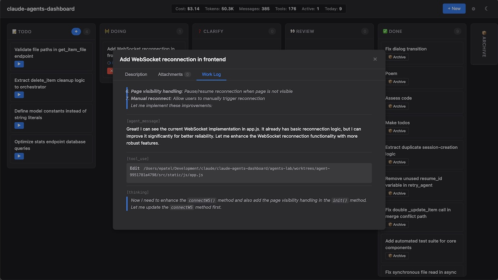
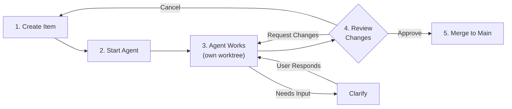
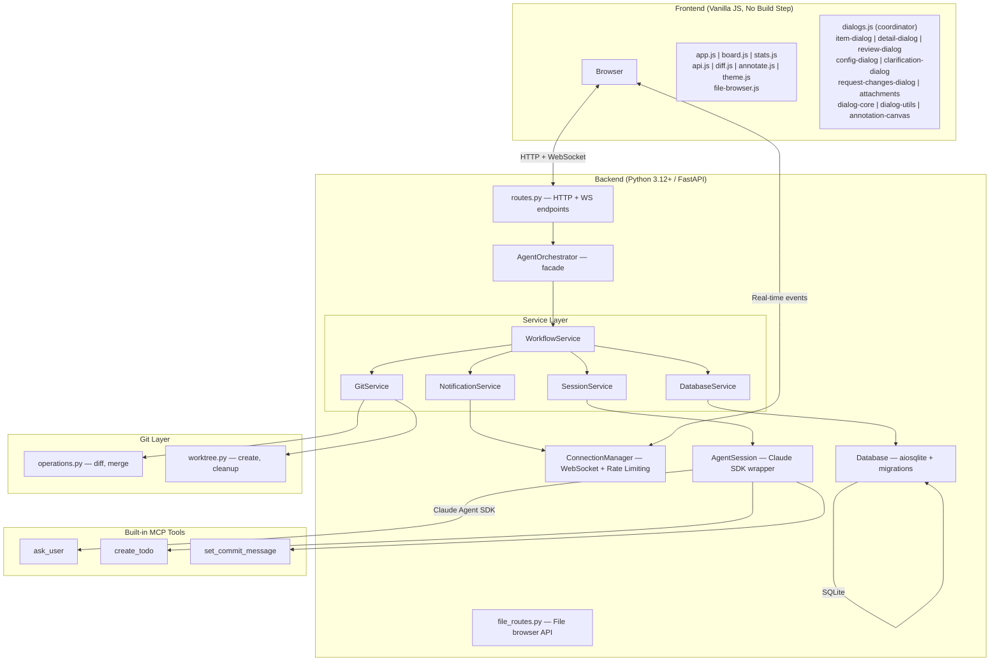
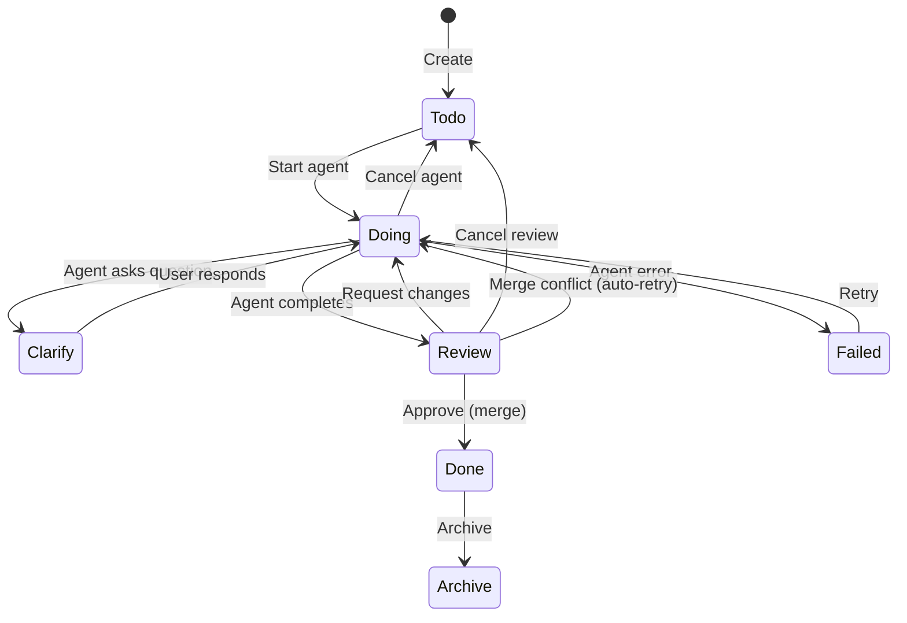
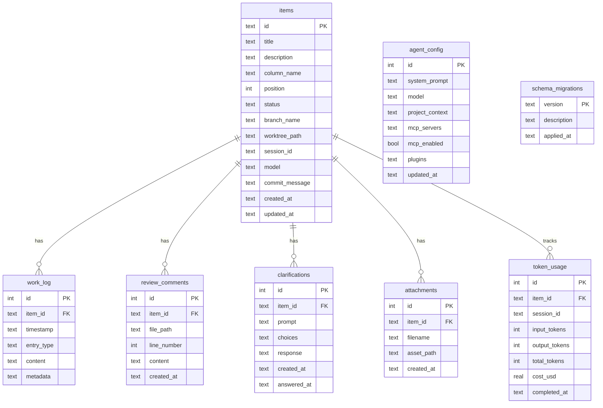

<a href="https://claude.ai"></a>



# Claude Agents Dashboard

A standalone scrum board that orchestrates Claude agents working on your project. Each board item becomes a task for an AI agent that works in its own git worktree, keeping changes isolated until you approve and merge them.

## Quick start

From your project repository:

```bash
path/to/claude-agents-dashboard/run.sh
```

Or pass the project path explicitly:

```bash
path/to/claude-agents-dashboard/run.sh /path/to/your/project
```

The server starts at `http://127.0.0.1:8000` (auto-increments ports 8000-8019 if busy). Your project must be a git repository. Requires Python 3.12+.

### Running tests

```bash
./run-tests.sh
```

Pass extra args to pytest: `./run-tests.sh tests/smoke/ -v` or `./run-tests.sh -k "test_cancel"`.

## How it works



1. **Create items** on the kanban board (Todo → Doing → Clarify → Review → Done → Archive)
2. **Start an agent** on a Todo item — it gets its own git worktree and runs autonomously
3. **Watch progress** in real-time via the work log (thinking, tool use, messages)
4. **Review changes** — browse the diff, approve to merge into main, or request changes
5. **Agent remembers** — when you request changes, it resumes its session with full context

## What it creates

An `agents-lab/` directory in your project (auto-added to `.gitignore`):

```
your-project/agents-lab/
  dashboard.db        # SQLite database
  assets/             # Uploaded images/attachments
  worktrees/          # Git worktrees for active agent tasks
```

The SQLite database uses a versioned migration system to manage schema changes safely.

## Features

- **Kanban board** with drag-and-drop (smooth card spacing), create/edit/delete items
- **Save & Start** — create an item and immediately launch an agent in one click
- **Agent orchestration** via Claude Agent SDK — multiple agents can run simultaneously
- **Git worktrees** — each agent works in isolation, branched off main
- **Live work log** — streaming agent output via WebSocket (messages, thinking, tool use)
- **Review & merge** — tabbed dialog with description, diff viewer, and work log; approve or request changes
- **Clarification flow** — agents can ask the user questions mid-task via custom MCP tool
- **Todo creation** — agents can create new todo items while working, breaking down complex tasks into smaller actionable items
- **Custom commit messages** — agents set meaningful commit messages via MCP tool, used when merging
- **Stats dashboard** — real-time header bar showing total cost, token usage, active agents, and items completed today; auto-refreshes every 10 seconds and on WebSocket events
- **Cost & token tracking** — agent completion logs USD cost and token consumption (input/output/total) per task, persisted to a dedicated `token_usage` table
- **Retry & cancel** — cancel a running agent or retry a failed one; retries reuse the existing worktree
- **Cancel review** — discard changes during review, clean up worktree/branch, and move item back to Todo
- **Session persistence** — request changes resumes the agent's conversation with full context
- **Annotation canvas** — drop images, scale/move them, draw arrows, circles, rectangles, and text; saved as PNG attachments
- **Attachments** — attach annotated screenshots and reference images to items
- **Per-item model selection** — choose between Claude Sonnet 4, Claude Opus 3, and Claude Haiku 3 per item (falls back to global config)
- **Agent config** — set system prompt, model, project context, MCP servers, and plugins
- **MCP support** — connect external tools and data sources via Model Context Protocol
- **Plugin support** — load local Claude Code plugins via directory paths
- **Merge conflict auto-resolution** — on merge conflict, captures the agent's diff, resets the worktree to the latest base branch, and restarts the agent with the previous diff as context for automated recovery
- **Item cleanup** — deleting an item stops running agents, removes worktrees and branches, and cleans up attachment files
- **WebSocket reconnection** — automatic reconnection with exponential backoff, visibility-aware, manual reconnect via status indicator
- **WebSocket rate limiting** — per-IP connection limits (5 concurrent, 10 per 60s window) prevent resource exhaustion
- **Stats caching** — server-side stats caching with 30s TTL, invalidated on mutations for fresh data
- **Git operation timeouts** — configurable timeouts for git operations (5min), merges (10min), and HTTP requests (11min)
- **File browser** — browse the target project's source code in a full-featured dialog with directory tree, tabbed file viewer, Prism.js syntax highlighting, rendered markdown with mermaid diagrams, inline image previews, secret file hiding, file filter, keyboard navigation, and breadcrumb navigation
- **Base branch tracking** — worktrees record which branch they were created from for reliable merge targeting
- **Light/dark mode** — respects system preference with manual toggle

## Architecture



### Technology stack

- **Backend**: Python, FastAPI, uvicorn, aiosqlite, 5-service architecture (Workflow, Database, Notification, Git, Session)
- **Frontend**: Jinja2 templates, vanilla HTML/CSS/JS, WebSocket, modular dialog system (10 specialized modules), Prism.js syntax highlighting, mermaid diagram rendering
- **Agent**: Claude Agent SDK (`claude-agent-sdk`), models: Claude Sonnet 4 (default), Claude Opus 3, Claude Haiku 3
- **Database**: SQLite with versioned migrations
- **Security**: Localhost only, no authentication, path traversal protection, WebSocket rate limiting, git operation timeouts

### Item lifecycle



## Requirements

- **Python 3.12+** (tested on macOS, Linux, and Windows with WSL)
- **Git** (any modern version)
- **Claude Code** - must be installed and logged in (`claude` CLI). The dashboard uses the Claude Agent SDK which authenticates through your Claude Code session — no API key needed
- **Internet connection** - for Claude API calls

## Example use cases

- **Bug fixes**: Create a "Fix login error" item, let an agent analyze logs and implement a solution
- **Feature development**: "Add dark mode toggle" → agent updates CSS, templates, and JavaScript
- **Code refactoring**: "Extract payment logic to service" → agent reorganizes code while preserving functionality
- **Documentation**: "Update API docs" → agent reviews code and updates documentation files
- **Testing**: "Add unit tests for user service" → agent analyzes code and writes comprehensive tests
- **Task breakdown**: Agents can create follow-up todos like "Add integration tests" or "Update documentation" as they discover related work

## Database Management

The project uses a SQLite database with a versioned migration system for safe schema updates. The schema is consolidated into a single migration (`001_initial_schema.py`) that creates all tables. Migrations run automatically on startup.

### Database schema



### Migration Commands

From the project root directory:

```bash
# Show current migration status
python -m src.manage status

# Run all pending migrations (also runs automatically on startup)
python -m src.manage migrate

# Migrate to a specific version
python -m src.manage migrate --to 002

# Rollback to a specific version
python -m src.manage rollback 001

# Initialize a fresh database
python -m src.manage init
```

### Database Location

The SQLite database is created at `your-project/agents-lab/dashboard.db`. You can specify a different location:

```bash
python -m src.manage status --db-path /path/to/custom/database.db
```

### Creating Migrations

1. Copy the migration template: `src/migrations/versions/000_template.py.example`
2. Rename to format: `XXX_description.py` (e.g., `002_add_user_settings.py`)
3. Update version number and description
4. Implement `up()` method (apply changes) and `down()` method (rollback changes)
5. Test thoroughly before deploying

## API Reference

### REST Endpoints

| Method | Path | Description |
|--------|------|-------------|
| `GET` | `/` | Board page (HTML) |
| `GET` | `/api/items` | List all items |
| `POST` | `/api/items` | Create item |
| `PATCH` | `/api/items/{id}` | Update item |
| `DELETE` | `/api/items/{id}` | Delete item (full cleanup) |
| `POST` | `/api/items/{id}/move` | Drag-drop reposition |
| `POST` | `/api/items/{id}/start` | Start agent |
| `POST` | `/api/items/{id}/cancel` | Cancel agent |
| `POST` | `/api/items/{id}/retry` | Retry failed agent |
| `POST` | `/api/items/{id}/approve` | Approve & merge |
| `POST` | `/api/items/{id}/request-changes` | Send feedback to agent |
| `POST` | `/api/items/{id}/cancel-review` | Discard review changes |
| `GET` | `/api/items/{id}/log` | Work log entries |
| `GET` | `/api/items/{id}/diff` | Diff + changed files |
| `GET` | `/api/items/{id}/files/{path}` | File content at branch |
| `GET` | `/api/items/{id}/clarification` | Pending clarification |
| `POST` | `/api/items/{id}/clarify` | Submit clarification response |
| `GET/POST` | `/api/items/{id}/attachments` | List/upload attachments |
| `DELETE` | `/api/attachments/{id}` | Delete attachment |
| `GET` | `/api/assets/{filename}` | Serve uploaded files |
| `GET/PUT` | `/api/config` | Agent configuration |
| `GET` | `/api/stats` | Usage & activity stats |
| `GET` | `/api/files/tree` | Directory tree (lazy, depth-limited) |
| `GET` | `/api/files/content` | File content (text, image, binary) |
| `WebSocket` | `/ws` | Real-time event stream |

### WebSocket Events

| Event | Direction | Description |
|-------|-----------|-------------|
| `item_created` | Server → Client | New item added |
| `item_updated` | Server → Client | Item fields changed |
| `item_moved` | Server → Client | Item repositioned |
| `item_deleted` | Server → Client | Item removed |
| `agent_log` | Server → Client | Agent activity (message, tool use, thinking) |
| `clarification_requested` | Server → Client | Agent needs user input |

## Troubleshooting

### Common issues

**Port already in use**: The server auto-increments ports (8000 → 8001 → 8002...), but if all ports in range are busy, restart the conflicting services or wait a moment.

**Agent fails to start**: Ensure Claude Code is installed and you're logged in:
```bash
claude --version  # Should show version
claude            # Opens interactive mode — log in if prompted
```

**Git worktree errors**: If you see git worktree issues, check that your project has at least one commit on the main/master branch:
```bash
git log --oneline -1  # Should show at least one commit
```

**Permission denied**: On some systems, you may need to make `run.sh` executable:
```bash
chmod +x /path/to/claude-agents-dashboard/run.sh
```

**Python version**: Verify you have Python 3.12+:
```bash
python3 --version  # Should show 3.12.0 or higher
```

### Getting help

If agents seem stuck or unresponsive, check the work log in the UI for error messages. You can always stop a running agent and restart it, or move items back to "Todo" to try a different approach.

## Multiple projects

Each project gets its own server instance. Run `run.sh` from different repos — ports auto-increment (8000, 8001, 8002, ...).

## License

[MIT](LICENSE)
