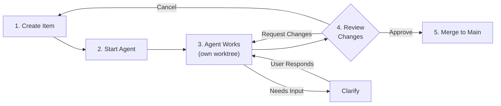
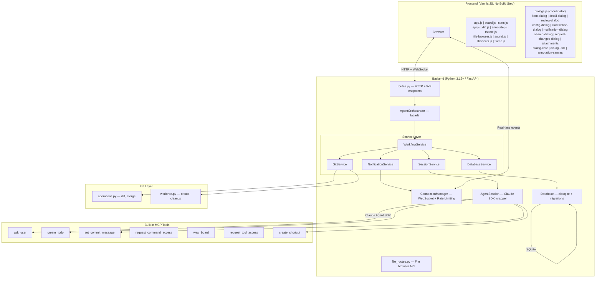
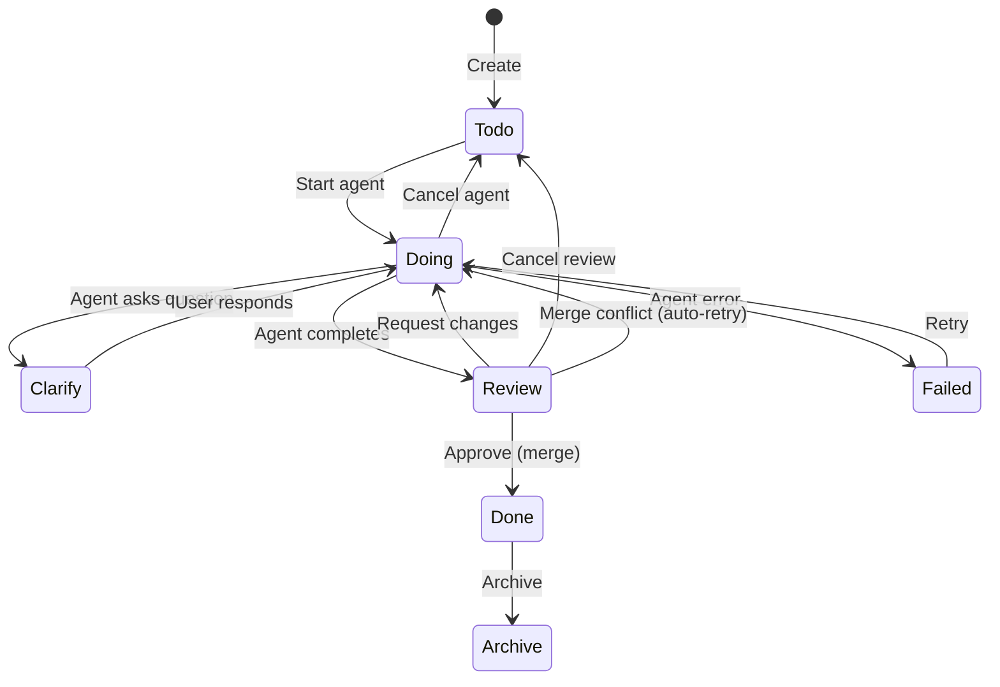
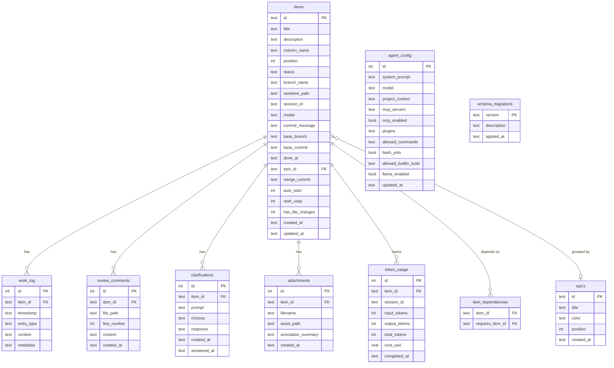

<a href="https://claude.ai"></a>


# Claude Agents Dashboard

A standalone scrum board that orchestrates Claude agents working on your project. Each board item becomes a task for an AI agent that works in its own git worktree, keeping changes isolated until you approve and merge them.

## Quick start

From your project repository:

```bash
path/to/claude-agents-dashboard/run.sh
```

Or pass the project path explicitly:

```bash
path/to/claude-agents-dashboard/run.sh /path/to/your/project
```

The server starts at `http://127.0.0.1:8000` (auto-increments ports 8000-8019 if busy). Open the dashboard in your browser — on macOS:

```bash
open http://127.0.0.1:8000
```

Your project must be a git repository. Requires Python 3.12+.

### Running tests

```bash
./run-tests.sh
```

Pass extra args to pytest: `./run-tests.sh tests/smoke/ -v` or `./run-tests.sh -k "test_cancel"`. The suite includes 856 tests across smoke, unit, and integration tiers, plus E2E tests via `./run-e2e-tests.sh`.

## How it works



1. **Create items** on the kanban board (Todo → Doing → Questions → Review → Done → Archive)
2. **Start an agent** on a Todo item — it gets its own git worktree and runs autonomously
3. **Watch progress** in real-time via the work log (thinking, tool use, messages)
4. **Review changes** — browse the diff, approve to merge into main, or request changes
5. **Agent remembers** — when you request changes, it resumes its session with full context

## What it creates

An `agents-lab/` directory in your project (auto-added to `.gitignore`):

```
your-project/agents-lab/
  dashboard.db        # SQLite database
  assets/             # Uploaded images/attachments
  worktrees/          # Git worktrees for active agent tasks
```

The SQLite database uses a versioned migration system to manage schema changes safely.

## Features

- **Kanban board** with drag-and-drop (smooth card spacing), create/edit/delete items
- **Save & Start** — create an item and immediately launch an agent in one click
- **Start Copy** — start a copy of a Todo item while keeping the original, useful for running task variations
- **Agent orchestration** via Claude Agent SDK — multiple agents can run simultaneously
- **Git worktrees** — each agent works in isolation, branched off main
- **Live work log** — streaming agent output via WebSocket (messages, thinking, tool use)
- **Review & merge** — tabbed dialog with description, diff viewer, and work log; approve or request changes
- **Clarification flow** — agents can ask the user questions mid-task via custom MCP tool
- **Todo creation** — agents can create new todo items while working, breaking down complex tasks into smaller actionable items; supports `requires` parameter to declare dependencies between items and `auto_start` to automatically launch agents when dependencies are resolved
- **Custom commit messages** — agents set meaningful commit messages via MCP tool, used when merging
- **Board introspection** — agents can view the current board state (all items by column) via the `view_board` MCP tool to understand project context
- **Tool access requests** — agents can request permission to use optional built-in tools (WebSearch, WebFetch) at runtime via the `request_tool_access` MCP tool with user approval prompt
- **Done column day grouping** — completed items grouped by day (Today, Yesterday, etc.) with collapsible sections, compact title lists, and bulk archive per day group
- **Stats dashboard** — real-time header bar showing total cost, token usage, active agents, and items completed today; auto-refreshes every 10 seconds and on WebSocket events
- **Cost & token tracking** — agent completion logs USD cost and token consumption (input/output/total) per task, persisted to a dedicated `token_usage` table
- **System notifications** — bell icon in header with badge counter; surfaces MCP server connection failures, agent errors, and warnings; dismiss individually or clear all
- **MCP status monitoring** — automatically checks MCP server status after agent session connect; failed/disconnected/needs-auth servers create system notifications
- **Retry with session resume** — retry resumes the agent's previous session via session_id, preserving conversation context; falls back to fresh start if no session available
- **Cancel & cancel review** — cancel a running agent or discard review changes, clean up worktree/branch
- **Annotation canvas** — drop images, scale/move them, draw arrows, circles, rectangles, and text; saved as PNG attachments
- **Attachments** — attach annotated screenshots and reference images to items
- **Per-item model selection** — choose between Claude Sonnet 4, Claude Opus 3, and Claude Haiku 3 per item (falls back to global config)
- **Agent config** — set system prompt, model, project context, MCP servers, and plugins
- **MCP support** — connect external tools and data sources via Model Context Protocol; includes an example stdio server (`examples/mini-mcp/`) for reference
- **Plugin support** — load local Claude Code plugins via directory paths
- **Merge conflict auto-resolution** — on merge conflict, captures the agent's diff, resets the worktree to the latest base branch, and restarts the agent with the previous diff as context for automated recovery
- **Item cleanup** — deleting an item stops running agents, removes worktrees and branches, and cleans up attachment files
- **WebSocket reconnection** — automatic reconnection with exponential backoff, visibility-aware, manual reconnect via status indicator
- **WebSocket rate limiting** — per-IP connection limits (5 concurrent, 10 per 60s window) prevent resource exhaustion
- **Stats caching** — server-side stats caching with 30s TTL, invalidated on mutations for fresh data
- **Git operation timeouts** — configurable timeouts for git operations (5min), merges (10min), and HTTP requests (11min)
- **File browser** — browse the target project's source code in a full-featured dialog with directory tree, tabbed file viewer, Prism.js syntax highlighting, rendered markdown with mermaid diagrams, inline image previews, secret file hiding, file filter, keyboard navigation, and breadcrumb navigation
- **Allowed commands** — configure which shell commands agents can run (e.g., flutter, npm, cargo); agents can request access at runtime via MCP tool with user approval prompt
- **Bash YOLO mode** — optional mode that grants agents unrestricted bash access (configurable per project via agent config)
- **Base branch tracking** — worktrees record which branch they were created from for reliable merge targeting
- **Base commit pinning** — worktrees record the exact commit SHA at creation time, ensuring diffs remain stable even when the base branch moves forward (e.g., after merging other items)
- **Merge commit tracking** — stores the merge commit SHA when items are approved, enabling traceability from board items to git history
- **Dirty repo detection** — blocks merge if your working tree has uncommitted changes overlapping with the agent's files; moves the item to the Questions column with guidance to commit or stash first
- **Epic grouping** — organize items into epics with a collapsible progress panel above the board, colored badges on cards, Todo column grouping by epic, board filtering by epic, inline epic creation in the item dialog, and agent integration via MCP tools; 8 preset colors with light/dark theme variants
- **Auto-start pipelines** — items with `auto_start` enabled automatically launch an agent when all their dependency items are completed, enabling pipeline-style workflows
- **Search** — spotlight-style search dialog (Cmd/Ctrl+K) to find items across all columns and search work log entries
- **Archive cleanup** — archiving items automatically cleans up their worktree and session resources
- **Shortcut creation** — agents can add quick-launch bash command shortcuts to the board via the `create_shortcut` MCP tool (e.g., test runners, build commands)
- **Shortcuts bar** — quick-launch bash commands from a bar at the bottom of the board; commands run as subprocesses with streaming output, stop (preserves output log), reset, auto-reset mode, and cleanup
- **Worktree file browser** — browse an agent's worktree files during review via a tree view within the review dialog
- **Retry merge** — re-attempt a failed merge without restarting the agent
- **File change detection** — when an agent completes, the system detects whether any files were changed; review cards show "Done" (no changes) or "Approve & Merge" (has changes) accordingly
- **Standalone item detail page** — each item has a shareable URL; Done detail dialog includes a copy-link button for sharing
- **Animated flame background** — optional animated flame effect behind board columns with activity-driven intensity; configurable via agent config (flame_enabled setting)
- **Light/dark mode** — respects system preference with manual toggle

## Architecture



### Technology stack

- **Backend**: Python, FastAPI, uvicorn, aiosqlite, 5-service architecture (Workflow, Database, Notification, Git, Session), ~7,395 lines
- **Frontend**: Jinja2 templates, vanilla HTML/CSS/JS, WebSocket, modular dialog system (12 specialized modules), Prism.js syntax highlighting, mermaid diagram rendering, ~7,454 lines JS + ~3,455 lines CSS
- **Agent**: Claude Agent SDK (`claude-agent-sdk`), models: Claude Sonnet 4 (default), Claude Opus 3, Claude Haiku 3, 7 built-in MCP tools
- **Database**: SQLite with 15 versioned migrations
- **Security**: Localhost only, no authentication, path traversal protection, WebSocket rate limiting, git operation timeouts

### Item lifecycle



## Requirements

- **Python 3.12+** (tested on macOS, Linux, and Windows with WSL)
- **Git** (any modern version)
- **Claude Code** - must be installed and logged in (`claude` CLI). The dashboard uses the Claude Agent SDK which authenticates through your Claude Code session — no API key needed
- **Internet connection** - for Claude API calls

## Example use cases

- **Bug fixes**: Create a "Fix login error" item, let an agent analyze logs and implement a solution
- **Feature development**: "Add dark mode toggle" → agent updates CSS, templates, and JavaScript
- **Code refactoring**: "Extract payment logic to service" → agent reorganizes code while preserving functionality
- **Documentation**: "Update API docs" → agent reviews code and updates documentation files
- **Testing**: "Add unit tests for user service" → agent analyzes code and writes comprehensive tests
- **Task breakdown**: Agents can create follow-up todos like "Add integration tests" or "Update documentation" as they discover related work

## Database Management

The project uses a SQLite database with a versioned migration system for safe schema updates. The schema starts with `001_initial_schema.py` that creates all core tables, with subsequent migrations (002–015) adding columns and tables incrementally. Migrations run automatically on startup.

### Database schema



### Migration Commands

From the project root directory:

```bash
# Show current migration status
python -m src.manage status

# Run all pending migrations (also runs automatically on startup)
python -m src.manage migrate

# Migrate to a specific version
python -m src.manage migrate --to 002

# Rollback to a specific version
python -m src.manage rollback 001

# Initialize a fresh database
python -m src.manage init
```

### Database Location

The SQLite database is created at `your-project/agents-lab/dashboard.db`. You can specify a different location:

```bash
python -m src.manage status --db-path /path/to/custom/database.db
```

### Creating Migrations

1. Copy the migration template: `src/migrations/versions/000_template.py.example`
2. Rename to format: `XXX_description.py` (e.g., `002_add_user_settings.py`)
3. Update version number and description
4. Implement `up()` method (apply changes) and `down()` method (rollback changes)
5. Test thoroughly before deploying

## API Reference

### REST Endpoints

| Method | Path | Description |
|--------|------|-------------|
| `GET` | `/` | Board page (HTML) |
| `GET` | `/api/items` | List all items |
| `POST` | `/api/items` | Create item |
| `PATCH` | `/api/items/{id}` | Update item |
| `DELETE` | `/api/items/{id}` | Delete item (full cleanup) |
| `POST` | `/api/items/{id}/move` | Drag-drop reposition |
| `POST` | `/api/items/{id}/start` | Start agent |
| `POST` | `/api/items/{id}/cancel` | Cancel agent |
| `POST` | `/api/items/{id}/retry` | Retry failed agent |
| `POST` | `/api/items/{id}/approve` | Approve & merge |
| `POST` | `/api/items/{id}/request-changes` | Send feedback to agent |
| `POST` | `/api/items/{id}/pause` | Pause running agent |
| `POST` | `/api/items/{id}/resume` | Resume paused agent |
| `POST` | `/api/items/{id}/cancel-review` | Discard review changes |
| `POST` | `/api/items/{id}/retry-merge` | Retry a failed merge |
| `POST` | `/api/items/{id}/start-copy` | Start a copy of a todo item |
| `POST` | `/api/items/{id}/approve-command` | Approve/deny agent command request |
| `GET` | `/api/items/{id}/dependencies` | Get item dependencies |
| `PUT` | `/api/items/{id}/dependencies` | Set item dependencies |
| `GET` | `/api/items/{id}/is-blocked` | Check if item is blocked |
| `GET` | `/api/items/blocked-status` | Blocked status for all items |
| `POST` | `/api/items/archive-by-date` | Bulk archive items by date |
| `POST` | `/api/items/delete-by-date` | Bulk delete items by date |
| `POST` | `/api/items/delete-by-epic` | Bulk delete items by epic |
| `GET` | `/api/items/{id}/worktree/tree` | Browse worktree directory tree |
| `GET` | `/api/items/{id}/worktree/content` | Read file from worktree |
| `GET` | `/api/items/{id}/log` | Work log entries |
| `GET` | `/api/items/{id}/diff` | Diff + changed files |
| `GET` | `/api/items/{id}/files/{path}` | File content at branch |
| `GET` | `/api/items/{id}/clarification` | Pending clarification |
| `POST` | `/api/items/{id}/clarify` | Submit clarification response |
| `GET/POST` | `/api/items/{id}/attachments` | List/upload attachments |
| `DELETE` | `/api/attachments/{id}` | Delete attachment |
| `GET` | `/api/assets/{filename}` | Serve uploaded files |
| `GET/PUT` | `/api/config` | Agent configuration |
| `GET` | `/api/notifications` | List system notifications |
| `DELETE` | `/api/notifications/{id}` | Dismiss a notification |
| `DELETE` | `/api/notifications` | Clear all notifications |
| `GET` | `/api/stats` | Usage & activity stats |
| `GET` | `/api/epics` | List all epics with progress stats |
| `POST` | `/api/epics` | Create epic |
| `PUT` | `/api/epics/{id}` | Update epic |
| `DELETE` | `/api/epics/{id}` | Delete epic (nullifies items' epic_id) |
| `GET` | `/api/config/available-tools` | List available optional tools |
| `GET` | `/api/search/worklog` | Search work log entries |
| `GET` | `/api/epics/colors` | Available epic colors |
| `GET` | `/api/shortcuts` | List shortcuts |
| `POST` | `/api/shortcuts` | Create shortcut |
| `DELETE` | `/api/shortcuts/{id}` | Delete shortcut |
| `POST` | `/api/shortcuts/{id}/run` | Run shortcut command |
| `POST` | `/api/shortcuts/{id}/stop` | Stop running shortcut (preserves output) |
| `GET` | `/api/shortcuts/{id}/output` | Get shortcut output |
| `POST` | `/api/shortcuts/{id}/reset` | Reset shortcut |
| `GET` | `/api/websocket/stats` | WebSocket connection stats |
| `GET` | `/api/files/tree` | Directory tree (lazy, depth-limited) |
| `GET` | `/api/files/content` | File content (text, image, binary) |
| `WebSocket` | `/ws` | Real-time event stream |

### WebSocket Events

| Event | Direction | Description |
|-------|-----------|-------------|
| `item_created` | Server → Client | New item added |
| `item_updated` | Server → Client | Item fields changed |
| `item_moved` | Server → Client | Item repositioned |
| `item_deleted` | Server → Client | Item removed |
| `agent_log` | Server → Client | Agent activity (message, tool use, thinking) |
| `clarification_requested` | Server → Client | Agent needs user input |
| `notification_added` | Server → Client | System notification (MCP error, agent failure) |
| `epic_created` | Server → Client | New epic added |
| `epic_updated` | Server → Client | Epic fields changed |
| `epic_deleted` | Server → Client | Epic removed |

## Troubleshooting

### Common issues

**Port already in use**: The server auto-increments ports (8000 → 8001 → 8002...), but if all ports in range are busy, restart the conflicting services or wait a moment.

**Agent fails to start**: Ensure Claude Code is installed and you're logged in:
```bash
claude --version  # Should show version
claude            # Opens interactive mode — log in if prompted
```

**Git worktree errors**: If you see git worktree issues, check that your project has at least one commit on the main/master branch:
```bash
git log --oneline -1  # Should show at least one commit
```

**Permission denied**: On some systems, you may need to make `run.sh` executable:
```bash
chmod +x /path/to/claude-agents-dashboard/run.sh
```

**Python version**: Verify you have Python 3.12+:
```bash
python3 --version  # Should show 3.12.0 or higher
```

### Getting help

If agents seem stuck or unresponsive, check the work log in the UI for error messages. You can always stop a running agent and restart it, or move items back to "Todo" to try a different approach.

## macOS app

A native macOS wrapper app is available under [Releases](../../releases) as a prebuilt `.app` bundle. It provides a desktop interface for managing multiple projects without using the terminal:

- **Add projects** via a file browser with smart suggestions (scans ~/Developer, ~/Development, etc.)
- **Start/stop dashboards** per project with real-time startup logs
- **Tabbed interface** — switch between running dashboards, each rendered in an embedded WebView
- **Auto-install** — on first run, clones the server repo to `~/.agents-dashboard/`, creates a Python venv, and installs dependencies
- **Update detection** — checks for upstream changes and prompts to pull

Requires macOS 14+. Source code is in `wrappers/macos/`.

## Multiple projects

Each project gets its own server instance. Run `run.sh` from different repos — ports auto-increment (8000, 8001, 8002, ...)

## Agent documentation

The `AGENT_FILES/` directory contains supplementary documentation for agents working on this project:

- `ASSESSMENT_CODE.md` — Full code assessment with module-by-module quality ratings and codebase statistics
- `AUDIT.md` — Security audit report with 14 findings (9 of 9 actionable remediated), threat model, and remediation tracking
- `COMMIT_POLICY.md` — Commit policies (e.g. excluding annotation images)
- `TESTING.md` — Detailed testing guide with test inventory (856 unit/integration tests + E2E tests), writing guidelines, and 15 database migrations

## License

[MIT](LICENSE)
