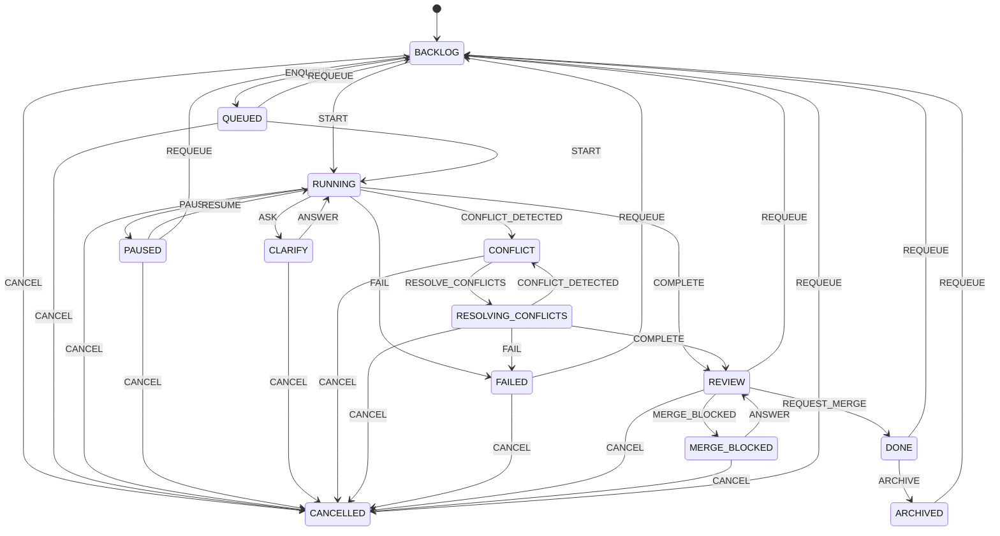

# Item state machine — audit & diagram

Reference for `src/domain/item_state.py`. Captures the 13 reachable states of an item and how it moves between them.

This doc is generated from an audit of `column_name` / `status` writes in `services/workflow_service.py` at the time `src/domain/item_state.py` was introduced. If transitions change, update both.

## State ↔ DB encoding

In storage, state lives in two columns: `items.column_name` and `items.status`. Every reachable state corresponds to exactly one `(column_name, status)` pair.

| `ItemState`           | `column_name` | `status`              | Meaning                                              |
| --------------------- | ------------- | --------------------- | ---------------------------------------------------- |
| `BACKLOG`             | `todo`        | `null`                | Fresh item, not yet started                          |
| `CANCELLED`           | `todo`        | `cancelled`           | User cancelled — sits in todo column for visibility  |
| `QUEUED`              | `doing`       | `queued`              | Wants to run but blocked by WIP limit                |
| `RUNNING`             | `doing`       | `running`             | Agent process active                                 |
| `PAUSED`              | `doing`       | `paused`              | User paused; SDK session captured for resume         |
| `FAILED`              | `doing`       | `failed`              | Agent crashed                                        |
| `CONFLICT`            | `doing`       | `conflict`            | Merge conflict detected, awaiting auto-recovery     |
| `RESOLVING_CONFLICTS` | `doing`       | `resolving_conflicts` | Agent restarted with conflict-resolution prompt      |
| `CLARIFY`             | `questions`   | `null`                | Agent called `ask_user`; waiting on user answer      |
| `MERGE_BLOCKED`       | `questions`   | `merge_blocked`       | Merge blocked, asking user how to proceed            |
| `REVIEW`              | `review`      | `null`                | Agent finished; awaiting human review / merge        |
| `DONE`                | `done`        | `null`                | Merged into base branch                              |
| `ARCHIVED`            | `archive`     | `null`                | Removed from board view                              |

## Transition diagram

## Source-of-truth audit (state writes in `workflow_service.py`)

These are the writes the state machine was built to model. They will be migrated through `transition()` in steps 1.4 – 1.7 of `REFACTOR_PLAN.md`.

| File:line                          | `column_name`            | `status`                | Mapped state             |
| ---------------------------------- | ------------------------ | ----------------------- | ------------------------ |
| workflow_service.py:77              | `doing`                  | `queued`                | `QUEUED`                 |
| workflow_service.py:132–133         | `doing`                  | `running`               | `RUNNING`                |
| workflow_service.py:219             | `todo`                   | `cancelled`             | `CANCELLED`              |
| workflow_service.py:231             | (unchanged)              | `paused`                | `PAUSED` (from RUNNING)  |
| workflow_service.py:265             | (unchanged)              | `running`               | `RUNNING` (from PAUSED)  |
| workflow_service.py:337             | `doing`                  | `running`               | `RUNNING`                |
| workflow_service.py:423             | `questions`              | `merge_blocked`         | `MERGE_BLOCKED`          |
| workflow_service.py:457, 482, 527   | `done`                   | `null`                  | `DONE`                   |
| workflow_service.py:548, 613        | (unchanged)              | `conflict`              | `CONFLICT`               |
| workflow_service.py:580             | `doing`                  | `resolving_conflicts`   | `RESOLVING_CONFLICTS`    |
| workflow_service.py:663             | `doing`                  | `running`               | `RUNNING`                |
| workflow_service.py:725             | `todo`                   | (unchanged)             | `BACKLOG` (requeue)      |
| workflow_service.py:819             | `review`                 | (unchanged)             | `REVIEW`                 |
| workflow_service.py:831, 852        | (unchanged)              | `failed`                | `FAILED`                 |
| workflow_service.py:887, 924, 997   | `questions`              | `null`                  | `CLARIFY`                |
| workflow_service.py:907, 980, 1048, 1203 | `doing`             | `running`               | `RUNNING`                |
| routes.py:384                       | `archive`                | (unchanged)             | `ARCHIVED`               |
| routes.py:876                       | `review`                 | `null`                  | `REVIEW`                 |
