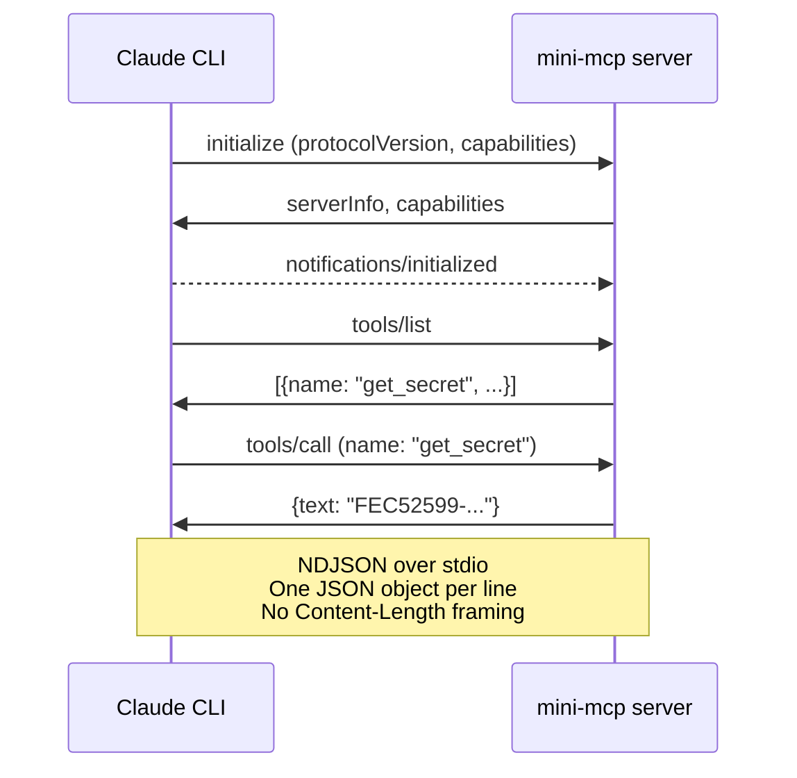

# Examples

## mini-mcp

A minimal MCP (Model Context Protocol) server in pure Python — no dependencies beyond stdlib. Exposes a single `get_secret` tool that returns a fixed UUID.

Use it as a starting point for building your own MCP tools that agents can call from the dashboard.

### How it works

The server communicates via **newline-delimited JSON** (NDJSON) over stdio. The Claude CLI spawns it as a subprocess and exchanges JSON-RPC messages — one per line, no `Content-Length` framing.

Protocol flow:



### Running standalone

```bash
# Test with a manual JSON-RPC message
echo '{"method":"initialize","params":{"protocolVersion":"2025-11-25","capabilities":{},"clientInfo":{"name":"test","version":"1.0"}},"jsonrpc":"2.0","id":0}' | python3 examples/mini-mcp/server.py
```

### Configuring in the dashboard

1. Open **Agent Configuration** (gear icon)
2. Go to the **MCP** tab, enable MCP
3. Add the server config (use absolute paths):

```json
{
    "mini-mcp": {
        "command": "/usr/bin/python3",
        "args": ["/absolute/path/to/examples/mini-mcp/server.py"]
    }
}
```

4. Save, then create a task: *"Use the get_secret tool and report the value"*

The agent will have access to `mcp__mini-mcp__get_secret`.

### Adding your own tools

To add a new tool, edit `server.py`:

1. Add it to `tools/list` response:
```python
{"name": "my_tool", "description": "Does something", "inputSchema": {"type": "object", "properties": {"arg": {"type": "string"}}, "required": ["arg"]}}
```

2. Handle it in `tools/call`:
```python
elif name == "my_tool":
    arg = msg.get("params", {}).get("arguments", {}).get("arg", "")
    respond(req_id, {"content": [{"type": "text", "text": f"Result: {arg}"}]})
```

### Tests

Unit tests (protocol-level): `./run-tests.sh tests/unit/test_mini_mcp.py`

E2E test (full agent flow): `./run-e2e-tests.sh` (runs `test_mini_mcp.mjs` among other tests)
